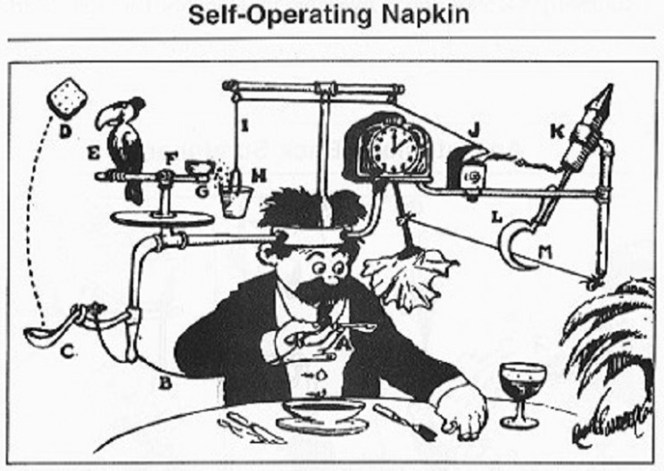
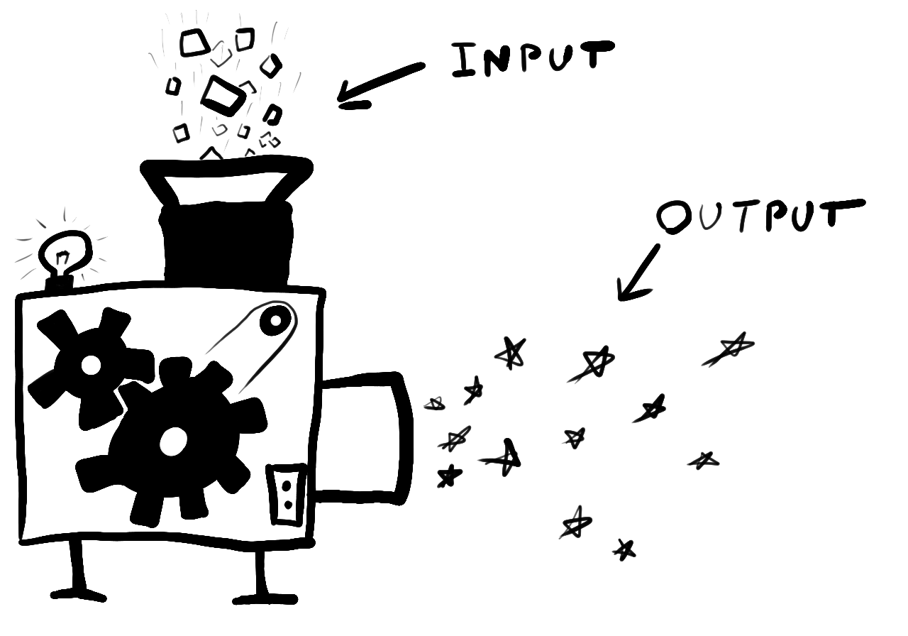

```{r setup, include=FALSE}
library(citr)
library(tidyverse)
library(psyntur)
library(ggthemes)
library(kableExtra)
library(knitr)
library(extrafont)
options("kableExtra.html.bsTable" = T)
knitr::opts_chunk$set(echo = FALSE,
                      comment=NA, 
                      warning = FALSE,
                      message =FALSE)

theme_set(theme_classic(base_size = 22) +
            theme(panel.grid = element_line(colour = "grey95")))

# Note assumptions of t, test, ANOVA etc (normality, linearly, skew, kurtosis) and how to check for them and what it means for the results if they aren't met [are results still reliable? Maybe find example of paper that has incorrectly used a model and ask if students should trust findings]. Try to get students to critically evaluate the application of statistics models.)

```

## Links to Statistics I module

- Statistical modelling I:	Interpret the results of statistical models (*t*-test, *ANOVA*, linear regression) in the context of the data
-	Statistical modelling II:	Justify a decision to use a particular statistical test given a data set
- Statistical inference I:	Describe the role of classical statistical inference in terms of the population and the sample


## Learning outcomes 


<div style="font-size:1.8em; ">
After completing this lecture, the workshop and your own reading you should be able to ...
</div>

- name the properties of the normal distribution
- explain the core assumptions of parametric tests
- describe the essence of the central limit theorem


# Model assumptions 

<div style="font-size:1.8em; ">
"All models are wrong, but some are useful." -- George Box
</div>


## (Statistical) Models

<div style="font-size:1.8em; ">
... are approximations of reality by reducing the complexity.
</div>

{width=80%}

## (Statistical) Models are also machines

<div style="font-size:1.5em; ">
Rube-Goldberg machine: a machine intentionally designed to perform a simple task in an overly complicated way.
</div>

{width=50%}


## Why are the model assumptions important? 

<div style="float: left; width: 40%;">
{width=100%}
</div>

<div style="float: right; width: 55%;">
- Machines need input.
- Perform operations on input.
- Always give some output.
- Parametric statistical models make assumptions about the input they receive.
- Reliability of output depends on the fit of input and assumptions.

</div>


## What is a parametric model? {.build}

- A family of probability distributions with a finite number of parameters (knobs on our machine).
- E.g. normal distribution has two parameters: mean and standard deviation
- Normal distribution is entailed in *t*-test, ANOVA, linear regression
- Non-parametric models do not make the same assumptions: e.g. Chi-squared [$\chi^2$] test, Mann Whitney U test, Spearman's rank correlation

## What do parametric models assume? 

- All parametric models make the same assumptions about their input.
- Normal distribution is at the heart of parametric models
  - Interval / continuous data
  - Central limit theorem
  - Observations must be independent and identically (iid) for the central limit theorem to apply.
    - See also lecture and workshop week 6
- Homogeneity of variance
- Linearity (for continuous predictors in regression models)


## What do parametric models assume? 
  
  - **L**inearity 
  - **I**ndependence
  - **N**ormality
  - **E**qual variance (aka homogeneity)


# Properties of the normal distribution 

-- aka the "bell curve" 


## Histograms {data-transition="fade-out"}

<div style="float: left; width: 45%;">

```{r out.width="100%", fig.height=7}
mean = 5
sd = 1
plot_range <- seq(0,11,2)
df <- data.frame(PF = rnorm(1000, mean = mean, sd = sd))
ggplot(df, aes(x = PF)) + 
    geom_histogram(bins = 20,  
                   colour = "black", 
                   fill = "white") +
    stat_function(fun = dnorm, args = list(mean = mean(df$PF), sd = sd(df$PF))) +
    scale_x_continuous(limits = c(min(plot_range), max(plot_range))) +
    labs(y = "Count", x = "x") 
```
</div>


<div style="float: right; width: 50%;">
- Counts / frequency of observations *x*.
</div>


## Density plot {data-transition="fade-in fade-out"}

<div style="float: left; width: 45%;">

```{r out.width="100%", fig.height=7}
mean = 5
sd = 1
df <- data.frame(PF = rnorm(1000, mean = mean, sd = sd))
ggplot(df, aes(x = PF)) + 
    geom_histogram(aes(y =..density..),
                   bins = 20,  
                   colour = "black", 
                   fill = "white") +
    stat_function(fun = dnorm, args = list(mean = mean(df$PF), sd = sd(df$PF))) +
    scale_x_continuous(limits = c(min(plot_range), max(plot_range))) +
    labs(y = "Density", x = "x") 
```
</div>


<div style="float: right; width: 50%;">
</div>


## Density plots {data-transition="fade-in fade-out"}

<div style="float: left; width: 45%;">

```{r out.width="100%", fig.height=7}
mean = 5
sd = 1
ggplot(data = NULL, aes(plot_range)) +
  stat_function(fun = dnorm, n = 101, args = list(mean = mean, sd = sd)) + 
  geom_area(stat = "function", fun = dnorm, args = list(mean = mean, sd = sd), 
            fill = "grey80", alpha = .5) +
  labs(y = "Density", x = "x")  
```
</div>


<div style="float: right; width: 50%;">
- Relative likelihood of *x* taking on a certain value.
- The normal distribution is defined by its density function.
- We don't need to worry about the maths here.
</div>


## Symmetric  {data-transition="fade-in fade-out"}

<div style="float: left; width: 45%;">

```{r out.width="100%", fig.height=7}
mean = 5
sd = 1
plot_range <- seq(0,11,2)

ggplot(data = NULL, aes(plot_range)) +
  stat_function(fun = dnorm, n = 101, args = list(mean = mean, sd = sd)) + 
  geom_area(stat = "function", fun = dnorm, args = list(mean = mean, sd = sd), 
            fill = "grey80", alpha = .5, xlim = c(1,9)) +
  labs(y = "Density", x = "x") +
  geom_vline(xintercept = mean, colour = "firebrick", linetype = "dotted", size = 2) 
```
</div>

<div style="float: right; width: 50%;">
- Left and right half are mirror images of each other
- Mean = Mode = Median
</div>


## Tails never hit zero  {data-transition="fade-in fade-out"}

<div style="float: left; width: 45%;">

```{r out.width="100%", fig.height=7}
ggplot(data = NULL, aes(plot_range)) +
  stat_function(fun = dnorm, n = 101, args = list(mean = mean, sd = sd)) + 
  geom_area(stat = "function", fun = dnorm, args = list(mean = mean, sd = sd), 
            fill = "grey80", alpha = .5) +
  labs(y = "Density", x = "x") +
  geom_segment(aes(x = 1.5, y = .01, xend = 2.5, yend = .1),
               arrow = arrow(length = unit(10, "mm"), ends = "first"),colour = "red") +
  geom_segment(aes(x = 9, y = .01, xend = 8, yend = .1),
               arrow = arrow(length = unit(10, "mm"), ends = "first"),colour = "red")
```
</div>


## Characterised by mean and standard deviation  {data-transition="fade-in fade-out"}


```{r fig.height=4}
mean2 = 5;sd2 = 3
mean3 = 6;sd3 = 1

M1 = paste0("Mean=", mean, ", SD=",sd)
M2 = paste0("Mean=", mean2, ", SD=",sd2)
M3 = paste0("Mean=", mean3, ", SD=",sd3)

ggplot(data = NULL, aes(plot_range)) +
  stat_function(fun = dnorm, n = 101, size = 1.5,
                args = list(mean = mean, sd = sd), 
                aes(colour = M1, linetype = M1)) + 
  labs(y = "Density", x = "x", color = "Legend", linetype = "Legend") +
  theme(legend.justification = "top",
        legend.key.width = unit(1, "cm")) +
  scale_colour_manual(values = "firebrick") +
  scale_linetype_manual(values = "solid")
```


## Characterised by mean and standard deviation  {data-transition="fade-in fade-out"}

```{r fig.height=4}
ggplot(data = NULL, aes(plot_range)) +
  stat_function(fun = dnorm, n = 101, size = 1.5,
                args = list(mean = mean, sd = sd), 
                aes(colour = M1, linetype = M1)) + 
  stat_function(fun = dnorm, n = 101, size = 1.5,
                args = list(mean = mean2, sd = sd2), 
                aes(colour = M2, linetype = M2)) + 
  labs(y = "Density", x = "x", color = "Legend", linetype = "Legend") +
  theme(legend.justification = "top",
        legend.key.width = unit(1, "cm")) +
  scale_colour_manual(values = c("firebrick", "blue")) +
  scale_linetype_manual(values = c("solid", "dashed"))
```


## Characterised by mean and standard deviation  {data-transition="fade-in fade-out"}


```{r fig.height=4}
ggplot(data = NULL, aes(plot_range)) +
  stat_function(fun = dnorm, n = 101, size = 1.5,
                args = list(mean = mean, sd = sd), 
                aes(colour = M1, linetype = M1)) + 
  stat_function(fun = dnorm, n = 101, size = 1.5,
                args = list(mean = mean2, sd = sd2), 
                aes(colour = M2, linetype = M2)) + 
  stat_function(fun = dnorm, n = 101, size = 1.5,
                args = list(mean = mean3, sd = sd3), 
                aes(colour = M3, linetype = M3)) + 
  labs(y = "Density", x = "x", color = "Legend", linetype = "Legend") +
  theme(legend.justification = "top",
        legend.key.width = unit(1, "cm")) +
  scale_colour_manual(values = c("firebrick", "blue", "forestgreen")) +
  scale_linetype_manual(values = c("solid", "dashed", "dashed"))
```

Aside: standard normal distribution is mean = 0 and SD = 1


## x is continuous  {data-transition="fade-in fade-out"}

<div style="float: left; width: 45%;">

```{r out.width="100%", fig.height=7}
ggplot(data = NULL, aes(plot_range)) +
  stat_function(fun = dnorm, n = 101, 
                args = list(mean = mean, sd = sd)) + 
  labs(y = "Density", x = "x")  
```
</div>

<div style="float: right; width: 50%;">
  - y is defined for every value of x
  - Non-continuous (discrete): binary outcomes, count data, ordinal, psychometric scales
</div>


## Area under the curve is 1 (=100%) {data-transition="fade-in fade-out"}

<div style="float: left; width: 45%;">

```{r out.width="100%", fig.height=7}
ggplot(data = NULL, aes(plot_range)) +
  stat_function(fun = dnorm, n = 101, args = list(mean = mean, sd = sd)) + 
  geom_area(stat = "function", fun = dnorm, args = list(mean = mean, sd = sd), 
            fill = "firebrick", alpha = .5) +
  labs(y = "Density", x = "x") 
```
</div>

<div style="float: right; width: 50%;">

</div>


## Area under the curve is 1 (=100%) {data-transition="fade-in fade-out"}

<div style="float: left; width: 45%;">

```{r out.width="100%", fig.height=7}
ggplot(data = NULL, aes(plot_range)) +
  stat_function(fun = dnorm, n = 101, args = list(mean = mean, sd = sd)) + 
  geom_area(stat = "function", fun = dnorm, args = list(mean = mean, sd = sd), 
            fill = "grey90", alpha = .25) +
  geom_area(stat = "function", fun = dnorm, args = list(mean = mean, sd = sd), 
            fill = "firebrick", alpha = .35, xlim = c(mean-sd,mean+sd)) +
  annotate("text", x = mean, y = .2, label = "68%", size = 8) +
  labs(y = "Density", x = "x") 
```
</div>

<div style="float: right; width: 50%;">
- 68% within 1 SD
</div>


## Area under the curve is 1 (=100%){data-transition="fade-in fade-out"}

<div style="float: left; width: 45%;">

```{r out.width="100%", fig.height=7}
ggplot(data = NULL, aes(plot_range)) +
  stat_function(fun = dnorm, n = 101, args = list(mean = mean, sd = sd)) + 
  geom_area(stat = "function", fun = dnorm, args = list(mean = mean, sd = sd), 
            fill = "grey90", alpha = .25) +
  geom_area(stat = "function", fun = dnorm, args = list(mean = mean, sd = sd), 
            fill = "firebrick", alpha = .35, xlim = c(mean-2*sd,mean+2*sd)) +
  annotate("text", x = mean, y = .2, label = "95%", size = 8) +
  labs(y = "Density", x = "x") 
```
</div>

<div style="float: right; width: 50%;">
- 95% within 2 SDs
</div>


## Area under the curve is 1 (=100%) {data-transition="fade-in fade-out"}

<div style="float: left; width: 45%;">

```{r out.width="100%", fig.height=7}
ggplot(data = NULL, aes(plot_range)) +
  stat_function(fun = dnorm, n = 101, args = list(mean = mean, sd = sd)) + 
  geom_area(stat = "function", fun = dnorm, args = list(mean = mean, sd = sd), 
            fill = "grey90", alpha = .25) +
  geom_area(stat = "function", fun = dnorm, args = list(mean = mean, sd = sd), 
            fill = "firebrick", alpha = .35, xlim = c(mean-3*sd,mean+3*sd)) +
  annotate("text", x = mean, y = .2, label = "99.7%", size = 8) +
  labs(y = "Density", x = "x") 
```
</div>

<div style="float: right; width: 50%;">
- 99.7% within 3 SDs
</div>


## Example: intelligence quotient

<div style="float: left; width: 45%;">

```{r out.width="100%", fig.height=7}
IQmean = 100
IQsd = 15
IQrange = seq(IQmean - (5*IQsd), IQmean + (5*IQsd), 30)
ggplot(data = NULL, aes(IQrange)) +
  stat_function(fun = dnorm, n = 101, args = list(mean = IQmean, sd = IQsd)) + 
  geom_area(stat = "function", fun = dnorm, args = list(mean = IQmean, sd = IQsd), 
            fill = "grey80", alpha = .25) +
  geom_area(stat = "function", fun = dnorm, args = list(mean = IQmean, sd = IQsd), 
            fill = "firebrick", alpha = .35, xlim = c(85,115)) +
  annotate("text", x =IQmean, y = .015, label = "68%", size = 8) +
  labs(y = "Density", x = "IQ") +
  scale_x_continuous(breaks = seq(40, 160, 20))
```
</div>

<div style="float: right; width: 50%;">
- Total score of standardised tests to assess human intelligence
- Population values defined: mean = 100, SD = 15
- $\sim$ 2/3 between 85 and 115
- 2.5% $>$ 130 (gifted)
- 2.5% $<$ 70 (impaired)
</div>

```{r}
#typically we don't know the population value
# unknown parameter value for each ppt
# we know the population IQ (because its defined)
# Compare to data below
```

## Example: IQ

<div style="float: left; width: 45%;">

```{r out.width="100%", fig.height=6}
IQmean = 100
IQsd = 15
IQrange = seq(IQmean - (5*IQsd), IQmean + (5*IQsd), 30)
ggplot(data = NULL, aes(IQrange)) +
  stat_function(fun = dnorm, n = 101, args = list(mean = IQmean, sd = IQsd)) + 
  geom_area(stat = "function", fun = dnorm, args = list(mean = IQmean, sd = IQsd), 
            fill = "grey80", alpha = .25) +
  geom_area(stat = "function", fun = dnorm, args = list(mean = IQmean, sd = IQsd), 
            fill = "firebrick", alpha = .35, xlim = c(85,115)) +
  annotate("text", x =IQmean, y = .015, label = "68%", size = 8) +
  labs(y = "", x = "IQ") +
  scale_x_continuous(breaks = seq(40, 160, 20))
```
</div>

<div style="float: right; width: 50%;">
- Each person has individual unknown IQ value.
- IQ tests aim to estimate this quantity.
- Intelligence is abstract by nature and can't be measured objectively unlike distance, mass, income
</div>


## Example: IQ {data-transition="fade-out"}


<div style="float: left; width: 30%;">
```{r}
data <- BaM::iq %>%
  pivot_longer(everything()) %>%
  mutate(name = gsub("[.]", " ", name)) 

data %>% arrange(desc(value)) %>% slice(1:8) %>% 
  kable("html", align = c("l", "r"), col.names = c("Country", "mean IQ")) %>%
  kable_styling(bootstrap_options = c("striped","hover", "responsive"), font_size = 20) 
```
</div>

<div style="float: right; width: 60%;">
- Standard IQ test measures intelligence and reasoning (mean = 100, SD = 15)
- Economic and cultural biases 
- Mean IQ scores from 80 countries; each value is a mean of totals (country mean of ppt totals)
- Taken from @gill2014bayesian [p. 85-86; data from @lynn2001iq]
</div>

## Example: IQ {data-transition="fade-in fade-out"}

<div style="float: left; width: 30%;">
```{r}
data <- BaM::iq %>%
  pivot_longer(everything()) %>%
  mutate(name = gsub("[.]", " ", name)) 

data %>% arrange(desc(value)) %>% slice(1:8) %>% 
  kable("html", align = c("l", "r"), col.names = c("Country", "mean IQ")) %>%
  kable_styling(bootstrap_options = c("striped", "hover", "responsive"), font_size = 20) 
```
</div>

<div style="float: right; width: 30%;">
```{r}
data <- BaM::iq %>%
  pivot_longer(everything()) %>%
  mutate(name = gsub("[.]", " ", name)) 

data %>% 
  arrange(value) %>%
  slice(2:9) %>% 
  kable("html", align = c("l", "r"), col.names = c("Country", "mean IQ")) %>%
  kable_styling(bootstrap_options = c("striped", "hover", "responsive"), font_size = 20) 
```
</div>


## Example: IQ

```{r fig.height=5}
data %>% 
  mutate(name = paste0(name, "\nIQ: ", value)) %>%  
  mutate(name = ifelse(!grepl("King", name), "", name)) %>%
  ggplot(aes(x = value, label = name)) +
  geom_histogram(binwidth = 5) +
  geom_text(aes(y = 10, x = value + 35), size = 5) +
  geom_segment(aes(x = filter(data, grepl("United Kingdom", name)) %>% pull(value), y = 6, xend = 124, yend = 8.75),
               arrow = arrow(length = unit(10, "mm"), ends = "first"),colour = "darkred") +
  scale_x_continuous(limits = c(30, 160), breaks = seq(20, 160, 20)) +
  stat_function(fun = function(x) dnorm(x, mean = IQmean, sd = IQsd) * 80 * 8,
    color = "darkred", size = 1) +
  labs(y = "Counts", x = "National IQ")

```

## Simulation {data-transition="fade-out"}

<div style="float: left; width: 45%;">
```{r out.width="100%", fig.height=7}
reps <- replicate(2000, sample(data$value, 30, replace = T) %>% mean())
ggplot(NULL, aes(x = reps)) +
#  geom_histogram(binwidth = 1) +
  scale_x_continuous(limits = c(75, 125)) +
  scale_y_continuous(limits = c(0, 400)) +
  labs(y = "Counts", x = "National IQ") +
  geom_vline(xintercept = 100, linetype = "dashed", colour = "darkred", size = 1)

```
</div>

<div style="float: right; width: 50%;">
- Is the IQ test economic / cultural biased?
- Difficult to replicate this study
</div>


## Simulation {data-transition="fade-in fade-out"}

<div style="float: left; width: 45%;">
```{r out.width="100%", fig.height=7}
reps <- replicate(2000, sample(data$value, 30, replace = T) %>% mean())
ggplot(NULL, aes(x = reps)) +
#  geom_histogram(binwidth = 1) +
  scale_x_continuous(limits = c(75, 125)) +
  scale_y_continuous(limits = c(0, 400)) +
  labs(y = "Counts", x = "National IQ") +
  geom_vline(xintercept = 100, linetype = "dashed", colour = "darkred", size = 1)

```
</div>

<div style="float: right; width: 50%;">
- So here is a quick simulation to redo this experiment 2,000 times 
  - Sample 30 countries from data
  - Calculate sample mean across sampled countries
  - Repeat 2,000 times
  - Sampling distribution (week 6)
</div>


## Simulation {data-transition="fade-in"}

<div style="float: left; width: 45%;">
```{r out.width="100%", fig.height=7}
reps <- replicate(2000, sample(data$value, 30, replace = T) %>% mean())
ggplot(NULL, aes(x = reps)) +
  geom_histogram(binwidth = 1) +
  scale_x_continuous(limits = c(75, 125)) +
  scale_y_continuous(limits = c(0, 400)) +
  labs(y = "Counts", x = "National IQ") +
  geom_vline(xintercept = 100, linetype = "dashed", colour = "darkred", size = 1)

```
</div>

<div style="float: right; width: 45%;">
- Notice that this distribution is normal.
- Given these results, countries with an average IQ of 100 would be outliers.
- We will see how and why this works later ...
</div>


```{r}
#(use IQ example? with a plot)
#- For example, even though IQ is defined as normal distributed it's precision is limited
#- Same for measuring height: with a ruler you can measure mms but not more precise than that.
# Caveat: psychological distance between items might not be linear (see Burkners paper and compare to measurements like cm and RTs)
# non-linear scale: log
# response times with long positive tails (next lecture)

```


## Example for non-normal responses {data-transition="fade-out"}

- Psychometric scales are neither continuous nor linear [see intro of @burkner2019ordinal].

{width=70%}  
Source: @robinson2018using

```{r}
# Linear distance between size measures eg. inch
#difference between "completely disagree" and "moderately disagree" may be much smaller in the ppt's mind than the difference between "moderately disagree" and "moderately agree"
#the distribution of ordinal responses may be nonnormal, particularly if very low or high values are frequently chosen. Third, variances of the unobserved variables that underlie the observed ordinal variables may differ between groups, conditions, time points, and so forth. Such unequal variances cannot be accounted for—or even detected, in some cases—with the ordinal- as-metric approach.
```

## Example for non-normal responses {data-transition="fade-in fade-out"}

<div style="float: left; width: 50%;">
{width=80%}  
</div>

<div style="float: right; width: 45%;">
- Response categories
- Limited discrete options (vs sliders)
- Ordinal: implicit order
- Not equidistant (vs, say, inch)
- See @liddell2018analyzing
- We will see why the use of lms is not unjustified.
</div>


## Caveats of normal distributions

<div style="float: left; width: 40%;">
{width=80%}  
</div>

<div style="float: right; width: 55%;">
- Strictly speaking, nothing is really normal distributed.
- Most variables have an upper and lower bound, e.g., people can't be fast than 0 secs or smaller than 0 inch.
- All observations are discrete in practice due to limitations of our measuring instruments.
- However, a normal distribution is often suitable for practical considerations.
</div>


## Normal distribution

- Parametric models assume that the data are normal distributed.
- We **know** IQ is normal distributed but our example didn't look normal at all.
- In fact, many methods psychologists obtain non-normal distributed data.  
- Why do we bother with the normal distribution?
- We will see in the following that the data don't need to be normal distributed at all.
- The reason is the **central limit theorem**.


## Recap questions 

- What is a parametric model: example, definition?
- What are the assumptions of parametric models?
- What might be the consequence of model violations?
- What are the properties of the normal distribution?
- What are the properties of a continuous variable?
- Why are psychometric scales (often) not continuous?


# Central limit theorem (CLT)


## Central limit theorem (CLT)

- The sampling distribution will be approximately normal for large sample sizes, regardless of the (type / shape of the) distribution which we are sampling from.
- We can use parametric statistical inference even if we are sampling from a population that is weird (i.e. not normal distributed), if our sample size is large enough.
- From week 6: mean of sampling distribution is estimate of population mean ($\mu$; Greek mu)
- Works also for totals (e.g. IQ), SDs, etc.
- Example for mean of depression scores.

## Demo of CLT {data-transition="fade-out"}

- CES-D scale: self-report depression [@radloff1977ces] 
- 22 items to assess the degree of depression
- 5-point Likert scale: Strongly disagree - Strongly agree
- Item 1: *I was bothered by things that usually don't bother me.*
- Item 2: *I had a poor appetite.*
- Item 3: *I did no feel like eating, even though I should have been hungry.*
- ...
- Item 22: *I didn't enjoy life.*

## Demo of CLT {data-transition="fade-in"}

- 5-point Likert: strongly disagree (1) -- strongly agree (2)

```{r echo=T}
N_items <- 22 # 22 items
response_options <- 1:5 # 5-point Likert scale
response_options
```

## Simulate one participant {data-transition="fade-out"}

```{r echo=T}
ppt_1 <- sample(response_options, N_items, replace = T)
ppt_1
```


## Simulate one participant {data-transition="fade-in fade-out"}

<div style="float: left; width: 50%;">
- Data are not normal (discrete, options 1-5, not symmetric)
- Total count of 22 items
</div>

<div style="float: right; width: 45%;">
```{r out.width="100%", fig.height=7}
ppt1_plot <- ggplot(NULL, aes(x = ppt_1)) +
  geom_histogram() +
  labs(x = "Response", y = "Counts", title = "Scores of ppt 1") + scale_x_continuous(labels = c("Strongly\ndisagree", "Disagree", "Neutral", "Agree", "Strongly\nagree"))
ppt1_plot
```
</div>


## Repeat for another participant {data-transition="fade-in fade-out"}

```{r echo=T}
(ppt_2 <- sample(response_options, N_items, replace = T))
```


## Calculate means for each participant {data-transition="fade-in fade-out"}

<div style="float: left; width: 40%;">
```{r echo=T}
mean(ppt_1); mean(ppt_2)
```

```{r}
ppts <- c(mean(ppt_1), mean(ppt_2))
```

- The distribution of the sample will approach normality as the number of participants increases.

</div>


<div style="float: right; width: 55%;">
```{r out.width="100%", fig.height=7}
ggplot(NULL, aes(x= ppts)) +
  geom_histogram()  +
  labs(x = "Response", y = "Counts", title = "Means of 2 ppts") +
  scale_x_continuous(limits = c(1,5),labels = c("Strongly\ndisagree", "Disagree", "Neutral", "Agree", "Strongly\nagree")) +
  scale_y_continuous(limits = c(0,2), breaks = seq(0,2,1))
```
</div>


## Repeat for 10 participants {data-transition="fade-in fade-out"}

```{r fig.height=5}
subjs <- replicate(10, mean(sample(response_options, N_items, replace = T)) %>% mean())
ggplot(NULL, aes(x= subjs)) +
  geom_histogram()  +
  labs(x = "Response", y = "Counts", title = "Means of 10 ppts") +
  scale_x_continuous(limits = c(1,5),labels = c("Strongly\ndisagree", "Disagree", "Neutral", "Agree", "Strongly\nagree")) +
  theme_classic(base_size = 18)

```


## Repeat for 100 participants {data-transition="fade-in fade-out"}

```{r fig.height=5}
subjs <- replicate(100, mean(sample(response_options, N_items, replace = T)) %>% mean())
ggplot(NULL, aes(x = subjs)) +
  geom_histogram()  +
  labs(x = "Response", y = "Counts", title = "Means of 100 ppts") +
  scale_x_continuous(limits = c(1,5),labels = c("Strongly\ndisagree", "Disagree", "Neutral", "Agree", "Strongly\nagree")) +
  theme_classic(base_size = 18)

```


## Repeat for 1,000 participants {data-transition="fade-in fade-out"}


```{r fig.height=5}
subjs <- replicate(1000, mean(sample(response_options, N_items, replace = T)) %>% mean())

ggplot(NULL, aes(x = subjs)) +
  geom_histogram() +
  labs(x = "Response", y = "Counts", 
       title = "Means of 1,000 ppts") +
  scale_x_continuous(limits = c(1,5),labels = c("Strongly\ndisagree", "Disagree", "Neutral", "Agree", "Strongly\nagree")) +
  theme_classic(base_size = 18)

```


## Repeat for 10,000 participants {data-transition="fade-in fade-out"}


```{r fig.height=5}
subjs <- replicate(100000, mean(sample(response_options, N_items, replace = T)) %>% mean())
ppt10k_plot <- ggplot(NULL, aes(x = subjs)) +
  geom_histogram() +
  labs(x = "Response", y = "Counts", title = "Means of 10k ppts") +
  scale_x_continuous(limits = c(1,5),labels = c("Strongly\ndisagree", "Disagree", "Neutral", "Agree", "Strongly\nagree")) +
  theme_classic(base_size = 18)
ppt10k_plot
```


## Demo of CLT {data-transition="fade-in"}

- **The magic:** we've sampled from discrete data but, using sample means, arrived at a normal distribution
- **CLT:** distribution of sample means approaches normality as the number of participants increases.
- Sample size is the crux.
- **iid** applies (independent and identically distributed)

<div style="float: left; width: 45%;">
```{r out.width="100%", fig.height=5}
ppt1_plot
```
</div>

<div style="float: right; width: 45%;">
```{r out.width="100%", fig.height=5}
ppt10k_plot
```
</div>


# Independent and identically distributed (iid) 

## Independent and identically distributed (iid) 

- Most fundamental assumptions for the CLT and therefore statistical tests
- Sampling / obtaining of the data.
- Sample is iid if each observation comes from the same distribution as the others and all observations are mutually independent. 


## Independence

- One observation must be unrelated from the next.
- Assessing the spread of COVID infections: sample **only one** person per house hold

{width=70%}  

## Independence

<div style="float: left; width: 42%; font-size:.8em; ">
- Self-report depression
- Item 1: *I was bothered by things that usually don't bother me.*
- Item 2: *I had a poor appetite.*
- Item 3: *I did no feel like eating, even though I should have been hungry.*
</div>

<div style="float: right; width: 55%;">
- Different questions related to the same psych phenomenon.
- Violations: 
  - repeating the same questions
  - testing the same people multiple times
  - not randomising the presentation order
- Consequence: 
  - Unreliable / biased results
</div>


```{r}
#- Certain areas and people are more vulnerable so this would affect the results.
#- prevelance would be higher in one household than on a city, county, country level
```

## Identical distribution

<div style="float: left; width: 50%;">
- Observations must come from the same distribution 
- or family of distributions: e.g. normal, Poisson (discrete count data), binomial (binary data)
- Depression example: 22 items about depression, all 5-point Likert scale

</div>

<div style="float: right; width: 45%;">
```{r out.width="100%", fig.height=7}
ppt1_plot + labs(title = "")
```
</div>

## Identical distribution

<div style="float: left; width: 50%;">
- Violation: 
  - measuring responses on different scales (6-point Likert, continuous scale)
  - studying the effect of snapchat on self esteem but including people without snapchat
  - asking questions about coffee preference to measure depression

</div>

<div style="float: right; width: 45%;">
```{r out.width="100%", fig.height=7}
ppt1_plot + labs(title = "")
```
</div>

## Identical distribution

<div style="float: left; width: 50%;">
- Self-report depression items
- Item 1: I was bothered by things that usually don't bother me.
- **Item 2: Flat white is too bitter.**
- Item 3: I did no feel like eating, even though I should have been hungry.

</div>

<div style="float: right; width: 45%;">
```{r out.width="100%", fig.height=7}
ppt1_plot + labs(title = "")
```
</div>

```{r}
# Create qualtrics quiz for in parallel
```


```{r}
# Exercise
#generate random numbers
# Demonstrate on IQ dataset

```

```{r}
# Lecture 2: model evaluation + violations
# brief repetition on each assumption
#- CLT
#- idd
#- normal distribution
#- continous data
#- linearity
#- homoscedasticity

# Evaluation: normality and independence of residuals (map onto previous lecture)
# youtube videos
# apply to lm for two group and RT data (lexical decision task)
# explain residuals
# test each normality and independence of residuals, homogenity of variance
# log normal transformation
# refer back to iid and CLT
# introduce skew and kurtosis

# CLT: possible biases in small samples
# unequal variance


```


## Recap questions 

- Why is sample size important in the context of model assumptions?
- What is the role of the CLT in the context of normal distributions?
- What is iid?


# Epilogue

## Summary

- Parametric models expect data with certain properties.
- Violations of parametric assumptions lead to unreliable results. 
- Normal distribution is in the centre of parametric models.
- The normal distribution can be characterised using a range of properties.
- Requirements for normal distribution:
  - large enough sample 
  - independent and identically distributed
- Because of CLT, we will arrive at a normal distribution if sample is large enough regardless of the shape of the distribution we're sampling from.


## Useful textbook resources

- @field2012discovering Chapter 5 (with R code)
- [Chapter 12.2 here](https://ademos.people.uic.edu/Chapter12.html#2_regression_assumptions)
- @baguley2012serious Chapter 9 (with R code)
- @matloff2019probability Chapter 8 and 9 (also 7) (with R code)
- @coolican2018research Chapter 17 (pages 483--486)
- @howitt2007introduction Chapter 5 


## Outlook

- Model assumptions: workshop task on normal distribution and CLT
- Model evaluation and violations


## References

<style>
    .reveal section p {
    display: inline-block;
    font-size: 0.5em;
    line-height: 1.2em;
    vertical-align: top;
    horizontal-align: left;
    margin: 0 0 0 0;
    line-spacing: .5em;
  }
</style>

```{r}
#<style>
#slides > slide { overflow: scroll; width: 100% !important;}
#slides > slide:not(.nobackground):after {content: '';}
#</style>
```

