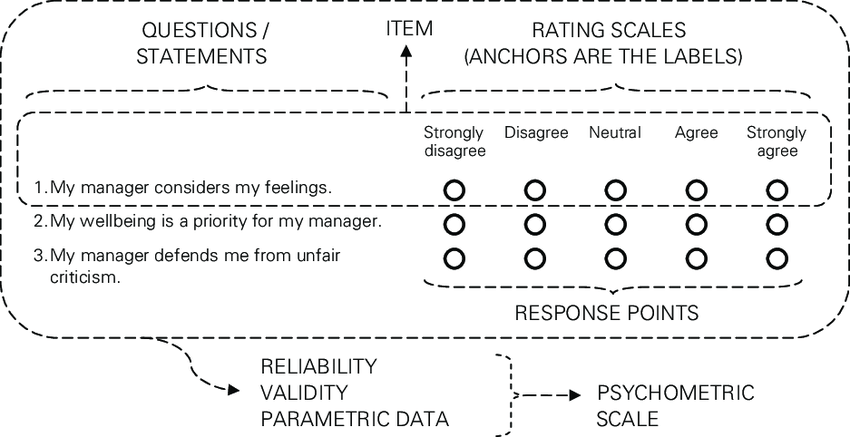

```{r setup, include=FALSE}
library(citr)
library(tidyverse)
library(psyntur)
library(ggthemes)
library(kableExtra)
library(knitr)
library(extrafont)
options("kableExtra.html.bsTable" = T)
knitr::opts_chunk$set(echo = FALSE,
                      comment=NA, 
                      warning = FALSE,
                      message =FALSE)

theme_set(theme_minimal(base_size = 16) +
            theme(panel.grid = element_line(colour = "grey95")))

# Note assumptions of t, test, ANOVA etc (normality, linearly, skew, kurtosis) and how to check for them and what it means for the results if they aren't met [are results still reliable? Maybe find example of paper that has incorrectly used a model and ask if students should trust findings]. Try to get students to critically evaluate the application of statistics models.)

```

## Link into the module

- Statistical modelling I:	Interpret the results of statistical models (*t*-test, *ANOVA*, linear regression) in the context of the data
-	Statistical modelling II:	Justify a decision to use a particular statsitical test given a dataset
- Statistical inference I:	Describe the role of classical statistical inference in terms of the population and the sample


## Learning outcomes | After completing this lecture and the workshop you should be able to {.build}

- name the properties of the normal distribution
- explain the core assumptions of parametric tests
- describe the essence of the central limit theorem


# Model assumptions | "All models are wrong, but some are useful." -- George Box

## Model assumptions | Why do we care? {.build}

- Models are approximations of reality by reducing the complexity.
- All models are wrong, but some are useful.
- But models are machines that respond to input; they will always give some results.
- Statistical models make assumptions about the input.
- Accuracy of the results depends on the correspondance between input (data) and assumptions.
- All parametric models make the same assumptions.
- Non-parametric models do not: e.g. Chi-squared [$\chi^2$] test, Mann Whitney U test, Spearman's rank correlation


{width=70%}


## What is a parametric model? {.build}

- A family of probability distributions with a finite number of parameters.
- E.g. normal distribution has two parameters: mean and standard devition
- Normal distribution is entailed in *t*-test, ANOVA, linear regression


## What do parametric models assume? {.build}

- Normal distribution is at the heart of parametrix models
- Interval / continous data
- Central limit theorem
- Observations are independent and identically distributed (iid)
  - See also lecture and workshop related to week 6
- Homogeneity of variance


# Properties of the normal distribution | aka the "bell curve" 


## Properties of the normal distribution {.build}

<div style="float: left; width: 55%;">

```{r out.width="100%", fig.height=5.25}
mean = 5
sd = 1
plot_range <- seq(0,11,2)
df <- data.frame(PF = rnorm(1000, mean = mean, sd = sd))
ggplot(df, aes(x = PF)) + 
    geom_histogram(bins = 20,  
                   colour = "black", 
                   fill = "white") +
    stat_function(fun = dnorm, args = list(mean = mean(df$PF), sd = sd(df$PF))) +
    scale_x_continuous(limits = c(min(plot_range), max(plot_range))) +
    labs(y = "Count", x = "x")  
```
</div>


<div style="float: right; width: 40%;">
- Histogram shows counts / frequency of observations *x*.
- Density plot describes the relative likelihood of *x* taking on a certain value.
</div>


## Properties of the normal distribution {.build}

<div style="float: left; width: 55%;">

```{r out.width="100%", fig.height=5.25}
mean = 5
sd = 1
df <- data.frame(PF = rnorm(1000, mean = mean, sd = sd))
ggplot(df, aes(x = PF)) + 
    geom_histogram(aes(y =..density..),
                   bins = 20,  
                   colour = "black", 
                   fill = "white") +
    stat_function(fun = dnorm, args = list(mean = mean(df$PF), sd = sd(df$PF))) +
    scale_x_continuous(limits = c(min(plot_range), max(plot_range))) +
    labs(y = "Density", x = "x")  
```
</div>


<div style="float: right; width: 40%;">
- Histogram shows counts / frequency of observations *x*.
- Density plot describes the relative likelihood of *x* taking on a certain value.
</div>


## Properties of the normal distribution {.build}

<div style="float: left; width: 55%;">

```{r out.width="100%", fig.height=5.25}
mean = 5
sd = 1
ggplot(data = NULL, aes(plot_range)) +
  stat_function(fun = dnorm, n = 101, args = list(mean = mean, sd = sd)) + 
  geom_area(stat = "function", fun = dnorm, args = list(mean = mean, sd = sd), 
            fill = "grey80", alpha = .5) +
  labs(y = "Density", x = "x")  
```
</div>


<div style="float: right; width: 40%;">
- Histogram shows counts / frequency of observations *x*.
- Density plot describes the relative likelihood of *x* taking on a certain value.
</div>

## Properties of the normal distribution {.build}


<div style="float: left; width: 55%;">

```{r out.width="100%", fig.height=5.25}
mean = 5
sd = 1
plot_range <- seq(0,11,2)
ggplot(data = NULL, aes(plot_range)) +
  stat_function(fun = dnorm, n = 101, args = list(mean = mean, sd = sd)) + 
  geom_area(stat = "function", fun = dnorm, args = list(mean = mean, sd = sd), 
            fill = "grey80", alpha = .5) +
  labs(y = "Density", x = "x")  
```
</div>


<div style="float: right; width: 40%;">
- Symmetrical
</div>


## Properties of the normal distribution 

<div style="float: left; width: 55%;">

```{r out.width="100%", fig.height=5.25}
ggplot(data = NULL, aes(plot_range)) +
  stat_function(fun = dnorm, n = 101, args = list(mean = mean, sd = sd)) + 
  geom_area(stat = "function", fun = dnorm, args = list(mean = mean, sd = sd), 
            fill = "grey80", alpha = .5, xlim = c(1,9)) +
  labs(y = "Density", x = "x") +
  geom_vline(xintercept = mean, colour = "firebrick", linetype = "dotted", size = 2)
```
</div>

<div style="float: right; width: 40%;">
- **Symmetrical**
  - Mean = Mode = Median
</div>

## Properties of the normal distribution 

<div style="float: left; width: 55%;">

```{r out.width="100%", fig.height=5.25}
ggplot(data = NULL, aes(plot_range)) +
  stat_function(fun = dnorm, n = 101, args = list(mean = mean, sd = sd)) + 
  geom_area(stat = "function", fun = dnorm, args = list(mean = mean, sd = sd), 
            fill = "firebrick", alpha = .5) +
  labs(y = "Density", x = "x") 
```
</div>

<div style="float: right; width: 40%;">
- Symmetrical
- **Area underneath the curve is 1**
</div>


## Properties of the normal distribution 

<div style="float: left; width: 55%;">

```{r out.width="100%", fig.height=5.25}
ggplot(data = NULL, aes(plot_range)) +
  stat_function(fun = dnorm, n = 101, args = list(mean = mean, sd = sd)) + 
  geom_area(stat = "function", fun = dnorm, args = list(mean = mean, sd = sd), 
            fill = "grey80", alpha = .5) +
  labs(y = "Density", x = "x") +
  geom_segment(aes(x = 1.5, y = .01, xend = 2.5, yend = .1),
               arrow = arrow(length = unit(10, "mm"), ends = "first"),colour = "red") +
  geom_segment(aes(x = 9, y = .01, xend = 8, yend = .1),
               arrow = arrow(length = unit(10, "mm"), ends = "first"),colour = "red")
```
</div>

<div style="float: right; width: 40%;">
- Symmetrical
- Area underneath the curve is 1
- **Tails approach but never hit zero**
</div>


## Properties of the normal distribution 

<div style="float: left; width: 55%;">

```{r out.width="100%", fig.height=5.25}
ggplot(data = NULL, aes(plot_range)) +
  stat_function(fun = dnorm, n = 101, args = list(mean = mean, sd = sd)) + 
  geom_area(stat = "function", fun = dnorm, args = list(mean = mean, sd = sd), 
            fill = "grey80", alpha = .5, xlim = c(1,9)) +
  labs(y = "Density", x = "x") 
```
</div>

<div style="float: right; width: 40%;">
- Symmetrical
- Area underneath the curve is 1
- Tails approach but never hit zero
- **Characterised by mean and standard deviation**
</div>


## Properties of the normal distribution

<div style="float: left; width: 55%;">

```{r out.width="100%", fig.height=5.25}
mean2 = 5;sd2 = 3
mean3 = 6;sd3 = 1

M1 = paste0("Mean=", mean, ", SD=",sd)
M2 = paste0("Mean=", mean2, ", SD=",sd2)
M3 = paste0("Mean=", mean3, ", SD=",sd3)

ggplot(data = NULL, aes(plot_range)) +
  stat_function(fun = dnorm, n = 101, 
                args = list(mean = mean, sd = sd), 
                aes(colour = M1, linetype = M1)) + 
  labs(y = "Density", x = "x", color = "Legend", linetype = "Legend") +
  theme(legend.justification = "top",
        legend.key.width = unit(1, "cm")) +
  scale_colour_manual(values = "firebrick") +
  scale_linetype_manual(values = "solid")
```
</div>

<div style="float: right; width: 40%;">
- Symmetrical
- Area underneath the curve is 1
- Tails approach but never hit zero
- **Characterised by mean and standard deviation**
</div>


## Properties of the normal distribution

<div style="float: left; width: 60%;">

```{r out.width="100%", fig.height=5.25}
ggplot(data = NULL, aes(plot_range)) +
  stat_function(fun = dnorm, n = 101, 
                args = list(mean = mean, sd = sd), 
                aes(colour = M1, linetype = M1)) + 
  stat_function(fun = dnorm, n = 101, 
                args = list(mean = mean2, sd = sd2), 
                aes(colour = M2, linetype = M2)) + 
  labs(y = "Density", x = "x", color = "Legend", linetype = "Legend") +
  theme(legend.justification = "top",
        legend.key.width = unit(1, "cm")) +
  scale_colour_manual(values = c("firebrick", "blue")) +
  scale_linetype_manual(values = c("solid", "dashed"))
```
</div>

<div style="float: right; width: 40%;">
- Symmetrical
- Area underneath the curve is 1
- Tails approach but never hit zero
- **Characterised by mean and standard deviation**
</div>


## Properties of the normal distribution 

<div style="float: left; width: 60%;">

```{r out.width="100%", fig.height=5.25}
ggplot(data = NULL, aes(plot_range)) +
  stat_function(fun = dnorm, n = 101, 
                args = list(mean = mean, sd = sd), 
                aes(colour = M1, linetype = M1)) + 
  stat_function(fun = dnorm, n = 101, 
                args = list(mean = mean2, sd = sd2), 
                aes(colour = M2, linetype = M2)) + 
  stat_function(fun = dnorm, n = 101, 
                args = list(mean = mean3, sd = sd3), 
                aes(colour = M3, linetype = M3)) + 
  labs(y = "Density", x = "x", color = "Legend", linetype = "Legend") +
  theme(legend.justification = "top",
        legend.key.width = unit(1, "cm")) +
  scale_colour_manual(values = c("firebrick", "blue", "forestgreen")) +
  scale_linetype_manual(values = c("solid", "dashed", "dashed"))
```
</div>

<div style="float: right; width: 40%;">
- Symmetrical
- Area underneath the curve is 1
- Tails approach but never hit zero
- **Characterised by mean and standard deviation**
  - Standard normal distribution: mean=0, SD=1
</div>


## Properties of the normal distribution

<div style="float: left; width: 55%;">

```{r out.width="100%", fig.height=5.25}
ggplot(data = NULL, aes(plot_range)) +
  stat_function(fun = dnorm, n = 101, 
                args = list(mean = mean, sd = sd)) + 
  labs(y = "Density", x = "x")  
```
</div>

<div style="float: right; width: 40%;">
- Symmetrical
- Area underneath the curve is 1
- Tails approach but never hit zero
- Characterised by mean and standard deviation
- **Continuous**
  - Every value on y is defined for a value x
</div>


## Properties of the normal distribution 

<div style="float: left; width: 55%;">

```{r out.width="100%", fig.height=5.25}
ggplot(data = NULL, aes(plot_range)) +
  stat_function(fun = dnorm, n = 101, args = list(mean = mean, sd = sd)) + 
  geom_area(stat = "function", fun = dnorm, args = list(mean = mean, sd = sd), 
            fill = "grey90", alpha = .25) +
  geom_area(stat = "function", fun = dnorm, args = list(mean = mean, sd = sd), 
            fill = "firebrick", alpha = .35, xlim = c(mean-sd,mean+sd)) +
  annotate("text", x = mean, y = .2, label = "68%", size = 8) +
  labs(y = "Density", x = "x") 
```
</div>

<div style="float: right; width: 40%;">
- Area underneath the curve is 1 (=100%)
- 68% within 1 SD
</div>


## Properties of the normal distribution

<div style="float: left; width: 55%;">

```{r out.width="100%", fig.height=5.25}
ggplot(data = NULL, aes(plot_range)) +
  stat_function(fun = dnorm, n = 101, args = list(mean = mean, sd = sd)) + 
  geom_area(stat = "function", fun = dnorm, args = list(mean = mean, sd = sd), 
            fill = "grey90", alpha = .25) +
  geom_area(stat = "function", fun = dnorm, args = list(mean = mean, sd = sd), 
            fill = "firebrick", alpha = .35, xlim = c(mean-2*sd,mean+2*sd)) +
  annotate("text", x = mean, y = .2, label = "95%", size = 8) +
  labs(y = "Density", x = "x") 
```
</div>

<div style="float: right; width: 40%;">
- Area underneath the curve is 1 (=100%)
- 68% within 1 SD
- 95% within 2 SDs
</div>


## Properties of the normal distribution 

<div style="float: left; width: 55%;">

```{r out.width="100%", fig.height=5.25}
ggplot(data = NULL, aes(plot_range)) +
  stat_function(fun = dnorm, n = 101, args = list(mean = mean, sd = sd)) + 
  geom_area(stat = "function", fun = dnorm, args = list(mean = mean, sd = sd), 
            fill = "grey90", alpha = .25) +
  geom_area(stat = "function", fun = dnorm, args = list(mean = mean, sd = sd), 
            fill = "firebrick", alpha = .35, xlim = c(mean-3*sd,mean+3*sd)) +
  annotate("text", x = mean, y = .2, label = "99.7%", size = 8) +
  labs(y = "Density", x = "x") 
```
</div>

<div style="float: right; width: 40%;">
- Area underneath the curve is 1 (=100%)
- 68% within 1 SD
- 95% within 2 SDs
- 99.7% wihtin 3 SDs
</div>


## Properties of the normal distribution 

- Continuous variable:
  - All values between negative and postive infinity are in principle possible.
  - All values between -Inf and +Inf are defined.
- Linearity assumption: 
  - Distances between adjacent values must be the same, i.e. $\pm 1$ on a linear scale.
  - Distances between 1 inch and 2 inch is 1 etc.

{width=70%}

## Properties of the normal distribution 

- Not continuous but discrete categories: 
  - binary outcomes, count data, ordinal, psychometric scales

## Properties of the normal distribution 

- Non linear: 
  - Logarithmic scale
  - Distance between units is $\cdot$ or $\div$ 10: 0.1, 1, 10, 100
  - Used to gain granularity on lower end of a scale but also include large numbers
  - In psychology log-transformations are often used for distributions with right skew (e.g. reaction times).


{width=70%}


## Properties of the normal distribution 

{width=70%}


## Properties of the normal distribution 

- Physiological and psychological development could be better represented on a log scale.

{width=70%}


## Properties of the normal distribution 

- Psychometric scales are neither continuous nor linear [see intro of @burkner2019ordinal].
- Response categories 
  - ordinal
  - limited response options
  - implicit order
  - not equidistant
- We will see later why the use of linear models is not unjustified for psychometric data.
- For a full discussion see @liddell2018analyzing

{width=70%}  

```{r}
#difference between "completely disagree" and "moderately disagree" may be much smaller in the ppt's mind than the difference between "moderately disagree" and "moderately agree"
#the distribution of ordinal responses may be nonnormal, particularly if very low or high values are frequently chosen. Third, variances of the unobserved variables that underlie the observed ordinal variables may differ between groups, conditions, time points, and so forth. Such unequal variances cannot be accounted for—or even detected, in some cases—with the ordinal- as-metric approach.
```


## Properties of the normal distribution 

- Striclty speaking, most things are not continuous.
- Most variables have an upper and lower bound, e.g., people can't be fast than 0 msecs or smaller than 0 inch.
- All observations are discrete in practice.
- A normal distribution is often suitable for practice considerations.


```{r}
#(use IQ example? with a plot)
#- For example, even though IQ is defined as normal distributed it's precision is limited
#- Same for measuring height: with a ruler you can measure mms but not more precise than that.
# Caveat: psychological distance between items might not be linear (see Burkners paper and compare to measurements like cm and RTs)
# non-linear scale: log
# response times with long positive tails (next lecture)

```


## Example: IQ

<div style="float: left; width: 45%;">

```{r out.width="100%", fig.height=6}
IQmean = 100
IQsd = 15
IQrange = seq(IQmean - (5*IQsd), IQmean + (5*IQsd), 30)
ggplot(data = NULL, aes(IQrange)) +
  stat_function(fun = dnorm, n = 101, args = list(mean = IQmean, sd = IQsd)) + 
  geom_area(stat = "function", fun = dnorm, args = list(mean = IQmean, sd = IQsd), 
            fill = "grey80", alpha = .25) +
  geom_area(stat = "function", fun = dnorm, args = list(mean = IQmean, sd = IQsd), 
            fill = "firebrick", alpha = .35, xlim = c(85,115)) +
  annotate("text", x =IQmean, y = .015, label = "68%", size = 8) +
  labs(y = "Density", x = "IQ") +
  scale_x_continuous(breaks = seq(40, 160, 20))
```
</div>

<div style="float: right; width: 50%;">
- Intelligence quotient: total score of standardised tests to assess human intelligence
- Population values are defined: mean = 100, SD = 15
- $\sim$ 2/3 of the population scores between 85 and 115
- 2.5% $>$ 130 (extremely high; gifted)
- 2.5% $<$ 70 (extremely low; impaired)
</div>

```{r}
#typically we don't know the population value
# unknown parameter value for each ppt
# we know the population IQ (because its defined)
# Compare to data below
```

## Example: IQ

<div style="float: left; width: 45%;">

```{r out.width="100%", fig.height=6}
IQmean = 100
IQsd = 15
IQrange = seq(IQmean - (5*IQsd), IQmean + (5*IQsd), 30)
ggplot(data = NULL, aes(IQrange)) +
  stat_function(fun = dnorm, n = 101, args = list(mean = IQmean, sd = IQsd)) + 
  geom_area(stat = "function", fun = dnorm, args = list(mean = IQmean, sd = IQsd), 
            fill = "grey80", alpha = .25) +
  geom_area(stat = "function", fun = dnorm, args = list(mean = IQmean, sd = IQsd), 
            fill = "firebrick", alpha = .35, xlim = c(85,115)) +
  annotate("text", x =IQmean, y = .015, label = "68%", size = 8) +
  labs(y = "", x = "IQ") +
  scale_x_continuous(breaks = seq(40, 160, 20))
```
</div>

<div style="float: right; width: 50%;">
- Each person has individual unknown IQ value.
- IQ tests aim to estimate this quantity.
- Intelligence is abstract by nature and can't be measured objectively unlike distance, mass, income
</div>


## Example: IQ | @gill2014bayesian, p. 85-86 [data from @lynn2001iq]


<div style="float: left; width: 30%;">
```{r}
data <- BaM::iq %>%
  pivot_longer(everything()) %>%
  mutate(name = gsub("[.]", " ", name)) 

data %>% arrange(desc(value)) %>% slice(1:8) %>% 
  kable("html", align = c("l", "r"), col.names = c("Country", "mean IQ")) %>%
  kable_styling(bootstrap_options = c("striped", "hover", "responsive"), font_size = 20) 
```
</div>

<div style="float: right; width: 60%;">
- Standard IQ test measure intelligence and reasoning (mean = 100, SD = 15)
- Economic and cultural biases
- Mean IQ scores from 80 countries; each value is a mean of totals (country mean of ppt totals)
</div>

## Example: IQ | @gill2014bayesian, p. 85-86 [data from @lynn2001iq]


<div style="float: left; width: 30%;">
```{r}
data <- BaM::iq %>%
  pivot_longer(everything()) %>%
  mutate(name = gsub("[.]", " ", name)) 

data %>% 
  arrange(value) %>%
  slice(2:9) %>% 
  kable("html", align = c("l", "r"), col.names = c("Country", "mean IQ")) %>%
  kable_styling(bootstrap_options = c("striped", "hover", "responsive"), font_size = 20) 
```
</div>

<div style="float: right; width: 60%;">
- Standard IQ test measure intelligence and reasoning (mean = 100, SD = 15)
- Economic and cultural biases
- Mean IQ scores from 80 countries; each value is a mean of totals (country mean of ppt totals)
</div>

## Example: IQ 

```{r }
data %>% 
  mutate(name = paste0(name, "\nIQ: ", value)) %>%  
  mutate(name = ifelse(!grepl("King", name), "", name)) %>%
  ggplot(aes(x = value, label = name)) +
  geom_histogram(binwidth = 1) +
  geom_text(aes(y = 4, x = value + 35), size = 5) +
  geom_segment(aes(x = filter(data, grepl("United Kingdom", name)) %>% pull(value), y = 4, xend = 124, yend = 3.75),
               arrow = arrow(length = unit(10, "mm"), ends = "first"),colour = "darkred") +
  scale_x_continuous(limits = c(30, 160), breaks = seq(20, 160, 20)) +
  stat_function(fun = function(x) dnorm(x, mean = IQmean, sd = IQsd) * 80 * 1,
    color = "darkred", size = 1) +
  labs(y = "Counts", x = "National IQ")

```

## Simulation

<div style="float: left; width: 50%;">
```{r out.width="100%", fig.height=5.25}
reps <- replicate(2000, sample(data$value, 30, replace = T) %>% mean())
ggplot(NULL, aes(x = reps)) +
#  geom_histogram(binwidth = 1) +
  scale_x_continuous(limits = c(75, 125)) +
  scale_y_continuous(limits = c(0, 400)) +
  labs(y = "Counts", x = "National IQ") +
  geom_vline(xintercept = 100, linetype = "dashed", colour = "darkred", size = 1)

```
</div>

<div style="float: right; width: 45%;">
- Is there a econommic / cultural bias?
- Difficult to replicate this study
- So here is a quick simulation:
  - Redo this experiment 2,000 times 
  - Sample 30 countries from data
  - Calculate sample mean across samples countries
  - Sampling distribution (week 6)
- We will see how this works later ...
</div>


## Simulation

<div style="float: left; width: 50%;">
```{r out.width="100%", fig.height=5.25}
reps <- replicate(2000, sample(data$value, 30, replace = T) %>% mean())
ggplot(NULL, aes(x = reps)) +
  geom_histogram(binwidth = 1) +
  scale_x_continuous(limits = c(75, 125)) +
  scale_y_continuous(limits = c(0, 400)) +
  labs(y = "Counts", x = "National IQ") +
  geom_vline(xintercept = 100, linetype = "dashed", colour = "darkred", size = 1)

```
</div>

<div style="float: right; width: 45%;">
- Is there a econommic / cultural bias?
- Difficult to replicate this study
- So here is a quick simulation:
  - Redo this experiment 2,000 times 
  - Sample 30 countries from data
  - Calculate sample mean across samples countries
  - Sampling distribution (week 6)
- We will see how this works later ...
</div>


## Normal distribution

- Parametric models assume that the data are normal distributed.
- We **know** IQ is normal distributed but our example didn't look normal at all.
- In fact, many methods psychologists obtain non-normal distributed data.  
- Why do we bother with the normal distribution?
- We will see in the following that the data don't need to be normal distributed at all.
- The reason is the **central limit theorem**.


## Recap questions 

- What is a parametric model?
- What are the properties of the normal distribution?
- What are the properties of a continous variable?
- What does linearity mean?
- Why are psychometric scales not continous?
- Why are or aren't non-linear data normal distributed?
  


# Central limit theorem (CLT)


## Central limit theorem (CLT)

- The sampling distribution mean will be approximately normally for large sample sizes, regardless of the distribution from which we are sampling.
- We can often use statistical inference that are based on a normal distribution even if we are sampling from a population that is weird (i.e. not normal), if we ensure a large sample size.
- Covered in Week 6: mean of the sampling distribution is estimate of population mean
- Works for means (e.g. depression), totals (e.g. IQ), SDs, etc.


## Application of CLT | a simulation

- CES-D scale: self-report depression [@radloff1977ces] 
- 22 items to assess the degree of depression
- 5-point Likert scale: Strongly disagree - Strongly agree
- Item 1: I was bothered by things that usually don't bother me.
- Item 2: I had a poor appetite.
- Item 3: I did no feel like eating, even tohugh I should have been hungry.
- ...
- Item 22: I didn't enjoy life.


## Application of CLT 

- The distribution of the sample approaches normality as the number of trials / participants increases.

```{r echo=T}
N_items = 22 # 22 items
response_options = 1:5 # 5-point Likert scale
(ppt_1 <- sample(response_options, N_items, replace = T))
```


## Application of CLT 

<div style="float: left; width: 40%;">
- Data are not normal: discrete values, range from 1-5, not symmetric
- Total of 22 items
</div>

<div style="float: right; width: 55%;">
```{r out.width="100%", fig.height=5.25}
ppt1_plot <- ggplot(NULL, aes(x = ppt_1)) +
  geom_histogram() +
  labs(x = "Depression score", y = "Counts", title = "Scores of ppt 1")
ppt1_plot
```
</div>


## Application of CLT

- Repeat for another ppt

```{r echo=T}
(ppt_2 <- sample(response_options, N_items, replace = T))
```


## Application of CLT 

<div style="float: left; width: 40%;">
```{r echo=T}
mean(ppt_1); mean(ppt_2)
```

```{r}
ppts <- c(mean(ppt_1), mean(ppt_2))
```
</div>


<div style="float: right; width: 55%;">
```{r out.width="100%", fig.height=5.25}
ggplot(NULL, aes(x= ppts)) +
  geom_histogram()  +
  labs(x = "Depression score", y = "Counts", title = "Means of 2 ppts") +
  scale_x_continuous(limits = c(1,5)) +
  scale_y_continuous(limits = c(0,2), breaks = seq(0,2,1))
```
</div>


## Application of CLT 

<div style="float: left; width: 40%;">
- Repeat for 10 ppts
</div>

<div style="float: right; width: 55%;">
```{r out.width="100%", fig.height=5.25}
subjs <- replicate(10, mean(sample(response_options, N_items, replace = T)) %>% mean())
ggplot(NULL, aes(x= subjs)) +
  geom_histogram()  +
  labs(x = "Depression score", y = "Counts", title = "Means of 10 ppts") +
  scale_x_continuous(limits = c(1,5)) 

```
</div>


## Application of CLT

<div style="float: left; width: 40%;">
- Repeat for 100 ppts
</div>

<div style="float: right; width: 55%;">
```{r out.width="100%", fig.height=5.25}
subjs <- replicate(100, mean(sample(response_options, N_items, replace = T)) %>% mean())
ggplot(NULL, aes(x = subjs)) +
  geom_histogram()  +
  labs(x = "Depression score", y = "Counts", title = "Means of 100 ppts") +
  scale_x_continuous(limits = c(1,5)) 

```
</div>

## Application of CLT

<div style="float: left; width: 40%;">
- Repeat for 1,000 ppts
</div>

<div style="float: right; width: 55%;">
```{r out.width="100%", fig.height=5.25}
subjs <- replicate(1000, mean(sample(response_options, N_items, replace = T)) %>% mean())

ggplot(NULL, aes(x = subjs)) +
  geom_histogram() +
  labs(x = "Depression score", y = "Counts", 
       title = "Means of 1,000 ppts") +
  scale_x_continuous(limits = c(1,5))

```
</div>

## Application of CLT

<div style="float: left; width: 40%;">
- Repeat for 10,000 ppts
</div>

<div style="float: right; width: 55%;">
```{r out.width="100%", fig.height=5.25}
subjs <- replicate(100000, mean(sample(response_options, N_items, replace = T)) %>% mean())
ppt10k_plot <- ggplot(NULL, aes(x = subjs)) +
  geom_histogram() +
  labs(x = "Depression score", y = "Counts", title = "Means of 10k ppts") +
  scale_x_continuous(limits = c(1,5))
ppt10k_plot
```
</div>


## Application of CLT {.build}

- **The magic:** we've sampled from a discrete distribution but, using sample means, arrived at a normal distribution
- CLT: the distribution of sample means approaches normality as the number of participants increases.
- Sampling must be **iid**, i.e. independent and identically distributed

<div style="float: left; width: 45%;">
```{r out.width="100%", fig.height=5}
ppt1_plot
```
</div>

<div style="float: right; width: 45%;">
```{r out.width="100%", fig.height=5}
ppt10k_plot
```
</div>


# Independent and identically distributed (iid) 

## Independent and identically distributed (iid) 

- Most fundamental assumptions for the CLT and therefore statistical tests
- Our observations are independent and identically distributed if each observation has the same distribution as the others and all observations are mutually independent. 
- Related to how the data were obtained.


## Independent and identically distributed (iid) | independence

- One observation must be unrelated from the next.
- Assessing the spread of COVID infections: sampled one person per house hold

- Depression example
  - 22 depression items with different questions

- Violations: 
  - repeating the same questions
  - testing the same people multiple times
  - not randomising the presentation order


```{r}
#- Certain areas and people are more vulnerable so this would affect the results.
#- prevelance would be higher in one household than on a city, county, country level
```


## Independent and identically distributed (iid) | identical distribution

- Observations must come from the same distribution 
- or family of distributions: e.g. normal, Poisson (discrete count data), binomial (binary data)
- Depression example: 22 items about depression, all 5-point Likert scale
- Violation: 
  - you want to assess depression but some questions ask about coffee preferences
  - including one 6-point Likert scale amongst 5-point Likert scales
  - studying the effect of snapchat on selfesteem but also including twitter users without snapchat account
  - vs. studying the effect of social media on selfesteem


# Homogeneity of variance

## Homogeneity of variance

<div style="float: left; width: 60%;">

```{r out.width="100%", fig.height=5.25}
mean = 100
sd = 10
M1 = paste0("Facebook users\nmean=", mean, ", SD=",sd)

plot_range <- c(50,150)
ggplot(data = NULL, aes(plot_range)) +
  stat_function(fun = dnorm, n = 101, 
                args = list(mean = mean, sd = sd), 
                aes(colour = M1, linetype = M1)) + 
  labs(y = "", x = "IQ", color = "Legend", linetype = "Legend") +
  theme(legend.justification = "top",
        legend.key.width = unit(1, "cm")) +
  scale_colour_manual(values = c("firebrick", "blue")) +
  scale_linetype_manual(values = c("solid", "dashed"))
```
</div>

<div style="float: right; width: 40%;">
- Homogeneity = same
- Heterogeneity = different
- Equality of variances
- Variance = SD$^2$: deviations between observations and their mean
-
</div>

## Homogeneity of variance


<div style="float: left; width: 60%;">

```{r out.width="100%", fig.height=5.25}
mean = 100
mean2 = 110
sd = 10
M1 = paste0("Facebook users\nmean=", mean, ", SD=",sd)
M2 = paste0("Twitter users\nmean=", mean2, ", SD=",sd)

plot_range <- c(50,150)
ggplot(data = NULL, aes(plot_range)) +
  stat_function(fun = dnorm, n = 101, 
                args = list(mean = mean, sd = sd), 
                aes(colour = M1, linetype = M1)) + 
  stat_function(fun = dnorm, n = 101, 
                args = list(mean = mean2, sd = sd), 
                aes(colour = M2, linetype = M2)) + 
  labs(y = "", x = "IQ", color = "Legend", linetype = "Legend") +
  theme(legend.justification = "top",
        legend.key.width = unit(1, "cm")) +
  scale_colour_manual(values = c("firebrick", "blue")) +
  scale_linetype_manual(values = c("solid", "dashed"))
```
</div>

<div style="float: right; width: 40%;">
- Homogeneity = same
- Heterogeneity = different
- Equality of variances
- Variance: deviations between observations and their mean (=SD$^2$)

</div>


## Homogeneity of variance


<div style="float: left; width: 60%;">

```{r out.width="100%", fig.height=5.25}
mean = 100
sd = 10
sd2 = 20
M1 = paste0("Facebook users\nmean=", mean, ", SD=",sd)
M2 = paste0("Social media users\nmean=", mean, ", SD=",sd2)

plot_range <- c(50,150)
ggplot(data = NULL, aes(plot_range)) +
  stat_function(fun = dnorm, n = 101, 
                args = list(mean = mean, sd = sd), 
                aes(colour = M1, linetype = M1)) + 
  stat_function(fun = dnorm, n = 101, 
                args = list(mean = mean, sd = sd2), 
                aes(colour = M2, linetype = M2)) + 
  labs(y = "", x = "IQ", color = "Legend", linetype = "Legend") +
  theme(legend.justification = "top",
        legend.key.width = unit(1, "cm")) +
  scale_colour_manual(values = c("firebrick", "blue")) +
  scale_linetype_manual(values = c("solid", "dashed"))
```
</div>

<div style="float: right; width: 40%;">
- Homogeneity = same
- Heterogeneity = different
- Equality of variances
- Variance = SD$^2$: deviations between observations and their mean
- More diverse groups are more plausible to have a larger variance (even if the means are the same).
- Levene's test
</div>

```{r}
# Create qualtrics quiz for in parallel
```


```{r}
# Exercise
#generate random numbers
# Demonstrate on IQ dataset

```

```{r}
# Lecture 2: model evaluation + violations
# brief repetition on each assumption
#- CLT
#- idd
#- normal distribution
#- continous data
#- linearity
#- homoscedasticity

# Evaluation: normality and independence of residuals (map onto previous lecture)
# youtube videos
# apply to lm for two group and RT data (lexical decision task)
# explain residuals
# test each normality and independence of residuals, homogenity of variance
# log normal transformation
# refer back to iid and CLT
# introduce skew and kurtosis

# CLT: possible biases in small samples
# unequal variance


```


# Epilogue

## Summary


- Sample size matters!
- Allegedly Stephen Hawking said when asked about his IQ "People who boast about their IQ are losers."


## Useful textbook resources
- @field2012discovering Chapter 5 (with R code)
- @baguley2012serious Chapter 9 (with R code)
- @matloff2019probability Chapter 8 and 9 (also 7) (with R code)
- @coolican2018research Chapter 17 (page 483--486)
- @howitt2007introduction Chapter 5 


## Outlook

- Model assumptions: workshop task
- Model evaluation: test assumptions
- Model violations: correction of violations


## References


<style>
slides > slide { overflow: scroll; }
slides > slide:not(.nobackground):after {
  content: '';
}
</style>