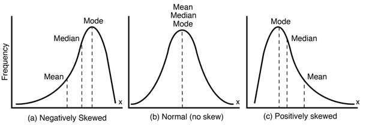
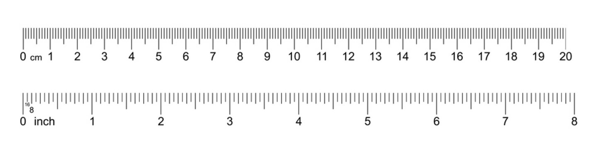
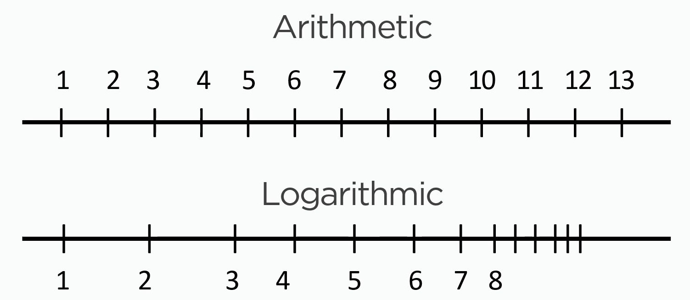
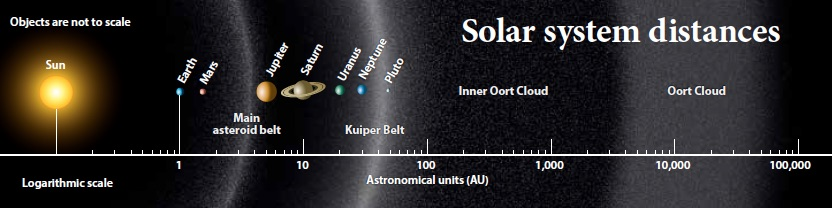
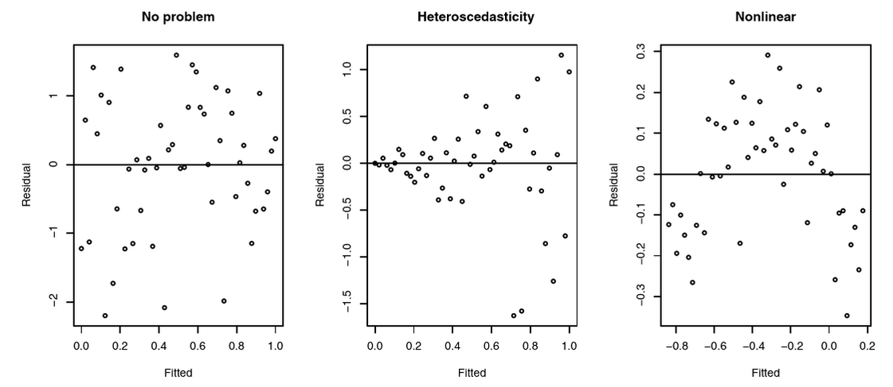

```{r setup, include=FALSE}
library(citr)
library(tidyverse)
library(magrittr)
library(psyntur)
library(ggthemes)
library(kableExtra)
library(knitr)
library(readxl)
library(extrafont)
library(broom)
options("kableExtra.html.bsTable" = T)
knitr::opts_chunk$set(echo = FALSE,
                      comment=NA, 
                      warning = FALSE,
                      message =FALSE)

theme_set(theme_classic(base_size = 16) +
            theme(panel.grid = element_line(colour = "grey95"),
                  panel.background = element_rect(fill = "transparent")))

# Note assumptions of t, test, ANOVA etc (normality, linearly, skew, kurtosis) and how to check for them and what it means for the results if they aren't met [are results still reliable? Maybe find example of paper that has incorrectly used a model and ask if students should trust findings]. Try to get students to critically evaluate the application of statistics models.)

```


# Learning outcomes 

<div style="font-size:1.8em; ">
After completing this lecture, the workshop and your own reading you should be able to ...
</div>

- explain what residuals are.
- run regression models with categorical predictors.
- evaluate the accuracy of a model on the basis of its unexplained variance.


# Model evaluation 

<div style="font-size:1.4em; ">
"Models are devices that connect theories to data. A model is an instantiation of a theory [...]" [@rouder2016interplay p. 2]
</div>

- Violations of model assumptions reduce the reliability of results.
- Possibility leading to misguiding conclusions about our data and therefore incorrect inference.
- Models are not either correct or wrong (because of possible violations).
- Some violations are more severe.
- Generally we need to be cautious with and conscious of violations when interpreting results.


## Assumptions of parametric models {data-transition="fade-out"}

- e.g. *t*-test, ANOVA, linear regression
- Remember **LINE**
- **L**inearity (for continuous predictor variables)
- **I**ndependence
- **N**ormality
- **E**qual variance (also homogeneity)

## Assumptions of parametric models  {data-transition="fade-in"}


<div style="font-size:1.3em; color:red;">
`lm(outcome ~ predictor, data)` 
</div>

- *t*-tests and *ANOVA*s can be translated into a linear model.
- `predictor` can be 
  - continuous 
  - factor with two levels (*t*-test)  
  - factor with three levels or more (*ANOVA*).
- Models can be evaluated on the basis of their residuals.


# Example data set 

## @blomkvist2017reference 

{width=130%}

- Age-related changes in cognitive performance through adolescence and adulthood in a real world task.

## StarCraft 2  {data-transition="fade-in fade-out"}

<div style="float: right;width: 45%;">
{width=100%}


- Real-time strategy video game

</div>
<div style="float: left;width: 45%;">
{width=100%}
</div>
<div style="float: left;width: 50%;">
{width=100%}
</div>


## @blomkvist2017reference  {data-transition="fade-in"}

<div style="float: left;width: 55%;">
```{r echo=F}
data <- read_csv("../data/blomkvist.csv") 

data %>% #  slice(1:5) %>%
  kable("html", digits = c(0,0,0,0,2),
        align = c("r", "r", "r", "r", "r")) %>%
  kable_styling(bootstrap_options = c("striped", "hover", "responsive"), font_size = 18) %>% scroll_box(width = "100%", height = "360px")
```

</div>

```{r}
data %<>% mutate(age_3 = factor(age_3, levels = unique(age_3)[c(2,3,1)], ordered = T),
                 age_2 = factor(age_2, levels = unique(age_2)[c(2,1)], ordered = T))
```

<div style="font-size:.9em;float: right;width: 40%;">
- **rt:** mean reaction time of dominant hand in msecs
- *N*=`r nrow(data)` participants
- Data available for non-dominant / dominant hand / feet, sex, smoker, etc.

</div>


## Age variable  {data-transition="fade-out"}

```{r echo=T}
summary(data$age) # continuous variable
```

## Age variable  {data-transition="fade-in fade-out"}

```{r echo=T}
summary(data$age) # continuous variable
```


```{r echo = T}
unique(data$age_2) # 2 groups
```

## Age variable  {data-transition="fade-in"}


```{r echo=T}
summary(data$age) # continuous variable
```

```{r echo = T}
unique(data$age_2) # 2 groups
```

```{r echo = T}
unique(data$age_3) # 3 groups
```

## Hypothesis

- Reaction times are longer (slower) for older participants.
- In other words, older age predicts longer reaction times regardless of whether age is a continuous predictor or a categorical predictor with two (*t*-test) or three (*ANOVA*) groups.


# Data visualisation and modelling

- Use `scatterplot`, `tukeyboxplot`, and `histogram` to inspect data.
- Use `lm` for continuous predictor (linear regression), and categorical predictors (*t*-test, *ANOVA*):

<div style="font-size:1.3em; color:red;line-height: 2em;">
`lm(rt ~ age, data = data)`
</div>


## Histogram 

```{r,  fig.height=4.1}
histogram(data = data, x = rt, bins = 20) + theme_classic(base_size = 16) 
```


## Continuous predictor  {data-transition="fade-in fade-out"}

<div style="float: left; width: 40%;">

```{r out.width="100%", fig.height=7}
scatterplot(data = data, x = age, y = rt, best_fit_line = T) + theme_classic(base_size = 22)
```
</div>

<div style="float: right; width: 60%;">

```{r echo=T}
model <- lm(rt ~ age, data = data)
```

```{r}
tidy(model) %>% mutate(`p.value` = ifelse(`p.value` < 0.001, "< 0.001", `p.value`)) %>% 
  rename(predictor = term,
         `t-value` = statistic,
         `p-value` = p.value) %>%
  kable("html", 
        align = c("l", "r", "r", "r", "r"), 
        digits = c(0, 2,2,2,999)) %>%
  kable_styling(bootstrap_options = c("striped","hover", "responsive"),
                font_size = 18) 
```
</div>


## 2 groups: *t*-test style model  {data-transition="fade-in fade-out"}

<div style="float: left; width: 40%;">

```{r out.width="100%", fig.height=7}
tukeyboxplot(data = data, x = age_2, y = rt) + 
  theme_classic(base_size = 22)
```
</div>

<div style="float: right; width: 60%;">


```{r echo = T}
model_2 <- lm(rt ~ age_2, data = data)
```

```{r}
tidy(model_2) %>% mutate(`p.value` = ifelse(`p.value` < 0.001, "< 0.001", `p.value`)) %>% 
  rename(predictor = term,
         `t-value` = statistic,
         `p-value` = p.value) %>%
  mutate(predictor = gsub("_2|.L", "", predictor)) %>%
  kable("html", 
        align = c("l", "r", "r", "r", "r"), 
        digits = c(0, 2,2,2,999)) %>%
  kable_styling(bootstrap_options = c("hover", "responsive", "striped"),
                font_size = 18) 
```

</div>


## 3 groups: *ANOVA*-style model  {data-transition="fade-in fade-out"}

<div style="float: left; width: 40%;">

```{r out.width="100%", fig.height=7}
tukeyboxplot(data = data, x = age_3, y = rt) + 
  theme_classic(base_size = 22)
```

</div>

<div style="float: right; width: 60%;">

```{r echo=TRUE, results=FALSE}
model_3 <- lm(rt ~ age_3, data = data)
anova(model_3)
```


```{r}
tidy(anova(model_3)) %>% mutate(`p.value` = ifelse(`p.value` < 0.001, "< 0.001", `p.value`)) %>% 
  rename(`F-value` = statistic,
         `p-value` = p.value) %>%
  mutate_if(is.numeric, round, 2) %>% 
  mutate_at(vars(sumsq, meansq), round, 0) %>%
  mutate_all(replace_na, "--") %>%
  kable("html", align = c("l", "r", "r", "r", "r", "r"), 
        digits = c(0,0,0,0,2,999)) %>%
  kable_styling(bootstrap_options = c( "hover", "responsive", "striped"), font_size = 16) 
```

</div>


# Model evaluation

## Using residuals to evaluate models:

- Normality of residuals
- Independence of residuals (remember *iid*)
- Homogeneity of variance of residuals
- Linearity: linear relationship between outcome and predictor(s)


## Outline 

- What are residuals?
- Normality of residuals: skewness, kurtosis, and log-transformation
- Independence of residuals: equality of variance, linearity


# What are residuals?

## What are residuals? {data-transition="fade-in fade-out"}


<div style="float: left; width: 50%;">

```{r out.width="100%", fig.height=7.5}
data$pred <- predict(model)
data$resid <- residuals(model)

ggplot(data, aes(x = age, y = pred) ) +
  geom_line(size = 2, colour = "red") +
  geom_point(aes(x = age, y = rt), size = 2) +
  geom_segment(
      aes(xend = age, yend = rt),
      size = 0.5, alpha = 0.5, lineend = "round"
      ) + theme_classic(base_size = 22) +
  labs(y = "rt")
```
</div>

<div style="float: right; font-size:.8em; width: 50%;">
- Residuals are the unexplained (residual) variance: error in the modelling results.
- Distance between observed ($y$) and predicted rt ($\hat{y}$): $\epsilon = y - \hat{y}$
- Some predictions are too low and other are too high.
- The closer the residuals are to 0, the lower the prediction error.

</div>


## What are residuals?  {data-transition="fade-in fade-out"}

```{r echo=T}
# Generate model predictions
data <- mutate(data, predicted = predict(model))
```

```{r}
select(data, id, age, rt, predicted) %>%
    kable("html", align = c("r", "r", "r", "r"), 
        digits = c(0,0,2,2)) %>%
  kable_styling(bootstrap_options = c( "hover", "responsive", "striped"), font_size = 16) %>% scroll_box(width = "75%", height = "300px")
```

## What are residuals? {data-transition="fade-in fade-out"}

```{r echo=T}
# Difference between observed rt and predicted values
data <- mutate(data, residuals = rt - predicted)
```

```{r}
select(data, id, age, rt, predicted, residuals) %>%
  kable("html", align = c("r", "r", "r", "r", "r"), digits = c(0,0,2,2,2)) %>%
  kable_styling(bootstrap_options = c( "hover", "responsive", "striped"), font_size = 16) %>% scroll_box(width = "100%", height = "300px")

```

## What are residuals? {data-transition="fade-in"}

```{r echo=T}
# Difference between observed rt and predicted values
data <- mutate(data, residuals = rt - predicted)
```


```{r echo=T}
# or simply do this to get the residuals
data <- mutate(data, residuals = residuals(model))
```


# Normality of residuals

## Normality of residuals  

```{r echo=T}
# Difference between observed rt and predicted values
data <- mutate(data, residuals = rt - predicted)
```


<div style="float: left; width: 50%;">

```{r out.width="100%", fig.height=5.5}
histogram(data, x = residuals, bins = 30) +
  labs(x = bquote("Residual error"~epsilon)) +
  theme_classic(base_size = 20)
```
</div>

<div style="float: right;  font-size:.8em;  width: 45%;">
- Distributed around 0
- Right / positive skew shows some **violation of normality assumption**
- rts are 0 bound and known to have a heavy right tail [see e.g. @baa08book]
</div>


## Normality: Skewness  {data-transition="fade-in fade-out"}

{width=95%, height=300px}


- Negatively skewed: skew < -2
- Normal: skew = 0
- Positively skewed: skew > 2


## What can we do about positive skew?  {data-transition="fade-in fade-out"}

- Logarithmic transformation is routinely used in the literature, especially for rts, to correct positive skew [see e.g. @baa08book].
- Can also be used for non-linear relationship.


## Linear / arithmetic scale  {data-transition="fade-in fade-out"}

- Distances between adjacent values must be the same, i.e. $\pm 1$ on a linear scale.
- Distances between 1 inch and 2 inch is 1 etc.

{width=100%}


## Logarithmic scale  {data-transition="fade-in fade-out"}

- Distance between units is going down as values go up.
- Granularity for small while also including large numbers.
- Basis 10 ($\cdot$ or $\div$ by 10): 0.1, 1, 10, 100

{width=70%}


## Logarithmic scale: example  {data-transition="fade-in fade-out"}

{width=110%}


## Transform from rt to log rt  {data-transition="fade-in fade-out"}

```{r echo=T}
data <- mutate(data, log_rt = log(rt)) 
```


<div style="float: left; width: 45%;">
```{r out.width="100%", fig.height=6.25}
histogram(data = data, x = rt, bins = 20) + 
  theme_classic(base_size = 22)
```
</div>

<div style="float: right; width: 45%;">
```{r out.width="100%", fig.height=6.25}
histogram(data = data, x = log_rt, bins = 20) + 
  theme_classic(base_size = 22) 
```
</div>


## Refit model with log rt  {data-transition="fade-in fade-out"}

```{r echo = T}
# Old model on rt
model <- lm(rt ~ age, data = data) 
```

```{r}
tidy(model) %>% mutate(`p.value` = ifelse(`p.value` < 0.001, "< 0.001", `p.value`)) %>% 
  rename(predictor = term,
         `t-value` = statistic,
         `p-value` = p.value) %>%
  kable("html", 
        align = c("l", "r", "r", "r", "r"), 
        digits = c(0, 2,2,2,999)) %>%
  kable_styling(bootstrap_options = c("striped","hover", "responsive"),
                font_size = 18) 
```

```{r echo = T}
# New model on log rt
log_model <- lm(log_rt ~ age, data = data) 
```

```{r}
tidy(log_model) %>% mutate(`p.value` = ifelse(`p.value` < 0.001, "< 0.001", `p.value`)) %>% 
  rename(predictor = term,
         `t-value` = statistic,
         `p-value` = p.value) %>%
  kable("html", 
        align = c("l", "r", "r", "r", "r"), 
        digits = c(0, 2,2,2,999)) %>%
  kable_styling(bootstrap_options = c("striped","hover", "responsive"),
                font_size = 18) 
```


## Compare model residuals  {data-transition="fade-in fade-out"}

<div style="float: left; width: 100%;">
```{r echo = F}
data <- mutate(data, residuals = residuals(model), # residuals of rt model
           residuals_log_model = residuals(log_model)) # residuals of log rt model
```
</div>

<div style="float: left; width: 45%;">

```{r out.width="100%", fig.height=6.75}
histogram(data = data, x = residuals, bins = 20) + theme_classic(base_size = 22) +
    labs(x = "residuals", title = "rt model")
```
</div>

<div style="float: right; width: 45%;">


```{r out.width="100%", fig.height=6.75}
histogram(data = data, x = residuals_log_model, bins = 20) + theme_classic(base_size = 22) +
  labs(x = "residuals", title = "log rt model")
```
</div>


## Assess skewness of residuals  {data-transition="fade-in"}

<div style="float: left; width: 48%;">
```{r echo=T}
library(moments)
# Skew of rts
skewness(residuals(model))
```
</div>

<div style="float: right; width: 48%;">
```{r echo=T}
# Skew of log rts
skewness(residuals(log_model))
```
</div>

<div style="float: center; width: 100%;">
{width=95%, height=300px}
</div>


## Normality: Kurtosis {data-transition="fade-out"}

```{r fig.height=4.5}
histogram(data = data, x = residuals_log_model, bins = 20) + theme_classic(base_size = 20) +
  labs(x = "residual rt of log model") 
```

## Normality: Kurtosis {data-transition="fade-in fade-out"}

```{r }
# remember 3 and that it goes alphabetically from top down
library(PearsonDS)
set.seed(123)
N = 5e4
K3 <- c(mean = 0, variance = 1, skewness = 0, kurtosis = 3)
KL3 <- c(mean = 0, variance = 1, skewness = 0, kurtosis = 10)
KS3 <- c(mean = 0, variance = 1, skewness = 0, kurtosis = 2)

kurt_data <- tibble(K3 = rpearson(N, moments = K3), 
       KL3 = rpearson(N, moments = KL3), 
       KS3 = rpearson(N, moments = KS3)) %>%
  pivot_longer(everything()) %>%
  mutate(name = recode(name, K3 = "Mesokurtic;\nkurtosis = 3",
                             KL3 = "Leptokurtic;\nkurtosis > 3",
                             KS3 = "Platykurtic;\nkurtosis < 3")) 
```


```{r fig.height=4.5}
kurt_data %>% 
  filter(name == "Mesokurtic;\nkurtosis = 3") %>%
  ggplot(aes(x = value)) + geom_density(size = 1, colour = "orange") +
  theme_classic(base_size = 20) +
  scale_colour_colorblind() +
  scale_x_continuous(limits = c(-3.25,3.25)) +
  scale_y_continuous(limits = c(0, .55)) +
  theme(axis.text = element_blank(),
        axis.ticks = element_blank(),
        legend.position = "none") +
  labs(x = "x", y = "Density") +
  annotate("text", x = 2.25, y = .4,  label = "Mesokurtic (k = 3):\nnormal distribution", size = 5) +
  geom_segment(aes(x = .8, y = .32, xend = 1.3, yend = .37),
               arrow = arrow(length = unit(3, "mm"), ends = "first"),colour = "orange") 
```


## Normality: Kurtosis {data-transition="fade-in fade-out"}


```{r fig.height=4.5}
kurt_data %>%
  filter(name != "Platykurtic;\nkurtosis < 3") %>%
  ggplot(aes(x = value, colour = name)) + geom_density(size = 1) +
  theme_classic(base_size = 20) +
  scale_colour_colorblind() +
  scale_y_continuous(limits = c(0, .55)) +
  scale_x_continuous(limits = c(-3.25,3.25)) +
  theme(axis.text = element_blank(),
        axis.ticks = element_blank(),
        legend.position = "none") +
  labs(x = "x", y = "Density") +
  annotate("text", x = 1.6, y = .5,  label = "Leptokurtic (k > 3)", size = 5) +
  annotate("text", x = 2.25, y = .4,  label = "Mesokurtic (k = 3)", size = 5) +
  geom_segment(aes(x = .3, y = .45, xend = 1, yend = .48),
               arrow = arrow(length = unit(3, "mm"), ends = "first"),colour = "grey40") +
  geom_segment(aes(x = .8, y = .32, xend = 1.5, yend = .38),
               arrow = arrow(length = unit(3, "mm"), ends = "first"),colour = "orange") 
```

## Normality: Kurtosis {data-transition="fade-in slide-out"}


```{r fig.height=4.5}
kurt_plot <- kurt_data %>% ggplot(aes(x = value, colour = name)) + geom_density(size = 1) +
  theme_classic(base_size = 20) +
  scale_colour_colorblind() +
  scale_y_continuous(limits = c(0, .55)) +
  scale_x_continuous(limits = c(-3.25,3.25)) +
  labs(x = "x", y = "Density") +
  annotate("text", x = 1.6, y = .5,  label = "Leptokurtic (k > 3)", size = 5) +
  annotate("text", x = 2.25, y = .4,  label = "Mesokurtic (k = 3)", size = 5) +
  annotate("text", x = 2.45, y = .3,  label = "Platykurtic (k < 3)", size = 5) +
  theme(axis.text = element_blank(),
        axis.ticks = element_blank(),
        legend.position = "none") +
  geom_segment(aes(x = .3, y = .45, xend = 1, yend = .48),
               arrow = arrow(length = unit(3, "mm"), ends = "first"),colour = "grey40") +
  geom_segment(aes(x = .8, y = .32, xend = 1.5, yend = .38),
               arrow = arrow(length = unit(3, "mm"), ends = "first"),colour = "orange") +
  geom_segment(aes(x = 1.6, y = .23, xend = 2, yend = .28),
               arrow = arrow(length = unit(3, "mm"), ends = "first"),colour = "lightblue")
kurt_plot
```


## Normality: Kurtosis {data-transition="fade-in"}

<div style="float: left; width: 45%;">
```{r out.width="100%", fig.height=6.5}
kurt_plot
```
</div>

<div style="float: right; width: 50%;">

```{r echo=T}
library(moments)
# Kurtosis of rt model
kurtosis(residuals(model))
```

```{r echo=T}
# Kurtosis of log rt model
kurtosis(residuals(log_model))
```

</div>


# Independence of residuals

## Independence of residuals  {data-transition="fade-out"}

- Must be independent and identically distributed (iid)
- Observation must be independent of previous one.
- We can assess independence on the basis of residuals.
- No correlation between (adjacent) residuals.

```{r}
select(data, id, age, rt, residuals) %>%
  kable("html", align = c("r", "r", "r", "r"), digits = c(0,0,2,2)) %>%
  kable_styling(bootstrap_options = c( "hover", "responsive", "striped"), font_size = 16) %>% scroll_box(width = "100%", height = "250px")

```


## Independence of residuals [see @faraway2014linear p. 74] {data-transition="fade-in fade-out"}

{width=81%}

## Independence of residuals [see @faraway2014linear p. 74] {data-transition="fade-in fade-out"}

{width=100%}


## Independence of residuals  {data-transition="fade-in fade-out"}

- Plot residuals across ppt id, predictor, predicted data
- What are we looking for?
- Dependencies or patterns: 
  - linearity, independence violations
  - For any predicted value, mean of residuals should be roughly 0. 
- Constant variance (equality of variance)
  - For any predicted value, the spread of the residuals should be about the same. 


## Independence of residuals  {data-transition="fade-in fade-out"}

```{r echo = FALSE, results=TRUE, fig.height=5}
scatterplot(data, y = residuals_log_model, x = id, best_fit_line = TRUE) +
  labs(y = "residuals of log model", x = "ppt id") +
  theme_classic(base_size = 22)
```


## Independence of residuals  {data-transition="fade-in fade-out"}

```{r echo = FALSE, results=TRUE, fig.height=5}
scatterplot(data = NULL, y = resid(log_model), 
            x = predict(log_model), 
            best_fit_line = TRUE) + 
  labs(y = "residuals of log model",
       x = "predicted log rt data") +
  theme_classic(base_size = 22)
```


## Homogeneity of variance {data-transition="fade-in fade-out"}

```{r echo = FALSE, results=TRUE, fig.height=5}
scatterplot(data = data, y = residuals_log_model, x = age) +
  labs(y = "residuals of log model") +
  theme_classic(base_size = 22)
```


## Homogeneity of variance {data-transition="fade-in fade-out"}
  
  
<div style="float: left; width: 50%;">
  
```{r out.width="100%", fig.height=6}
mean = 100
sd = 10
sd2 = 20
M1 = paste0("Group 1\nmean=", mean, ", SD=",sd)
M2 = paste0("Group 2\nmean=", mean, ", SD=",sd2)

plot_range <- c(50,150)
ggplot(data = NULL, aes(plot_range)) +
  stat_function(fun = dnorm, n = 101, size = 1.5,
                args = list(mean = mean, sd = sd), 
                aes(colour = M1, linetype = M1)) + 
  stat_function(fun = dnorm, n = 101, size = 1.5,
                args = list(mean = mean, sd = sd2), 
                aes(colour = M2, linetype = M2)) +
  theme_classic(base_size = 22) +
  labs(y = "", x = "x", color = "Legend", linetype = "Legend") +
  theme(legend.justification = "top",
        legend.key.width = unit(1, "cm")) +
  scale_colour_manual(values = c("firebrick", "blue")) +
  scale_linetype_manual(values = c("solid", "dashed")) 
```
</div>
  
<div style="float: right; width: 45%; font-size:.7em;">
- Equality of variance
- Homogeneity (same) vs heterogeneity (different)
- Variance = SD$^2$: deviations between observations and their mean
- More diverse groups have a larger variance
- Formal tests:
  - Levene (between groups)
  - Mauchly (within groups)
  - Breusch–Pagan (continuous predictors)
- We will use visual inspection (for now).
</div>


## Homogeneity of variance {data-transition="fade-out"}


```{r fig.width=8, fig.height=4.5}
mean = 100
sd = 10
M1 = paste0("Group 1\nmean=", mean, ", SD=",sd)

plot_range <- c(50,150)
ggplot(data = NULL, aes(plot_range)) +
  stat_function(fun = dnorm, n = 101, size = 1.5,
                args = list(mean = mean, sd = sd), 
                aes(colour = M1, linetype = M1)) + 
  labs(y = "", x = "x", color = "Legend", linetype = "Legend") +
  theme_classic(base_size = 20) +
  theme(legend.justification = "top",
        legend.key.width = unit(1, "cm")) +
  scale_colour_manual(values = c("firebrick", "blue")) +
  scale_linetype_manual(values = c("solid", "dashed")) 
```


## Homogeneity of variance {data-transition="fade-in fade-out"}
  

```{r fig.width=8, fig.height=4.5}
mean = 100
mean2 = 110
sd = 10
M1 = paste0("Group 1\nmean=", mean, ", SD=",sd)
M2 = paste0("Group 2\nmean=", mean2, ", SD=",sd)

plot_range <- c(50,150)
ggplot(data = NULL, aes(plot_range)) +
  stat_function(fun = dnorm, n = 101, size = 1.5,
                args = list(mean = mean, sd = sd), 
                aes(colour = M1, linetype = M1)) + 
  stat_function(fun = dnorm, n = 101, size = 1.5,
                args = list(mean = mean2, sd = sd), 
                aes(colour = M2, linetype = M2)) + 
  labs(y = "", x = "x", color = "Legend", linetype = "Legend") +
  theme_classic(base_size = 20) +
  theme(legend.justification = "top",
        legend.key.width = unit(1, "cm")) +
  scale_colour_manual(values = c("firebrick", "blue")) +
  scale_linetype_manual(values = c("solid", "dashed")) 
```


  
## Homogeneity of variance {data-transition="fade-in fade-out"}
  
  

```{r fig.width=8, fig.height=4.5}
mean = 100
sd = 10
sd2 = 20
M1 = paste0("Group 1\nmean=", mean, ", SD=",sd)
M2 = paste0("Group 2\nmean=", mean, ", SD=",sd2)

plot_range <- c(50,150)
ggplot(data = NULL, aes(plot_range)) +
  stat_function(fun = dnorm, n = 101, size = 1.5,
                args = list(mean = mean, sd = sd), 
                aes(colour = M1, linetype = M1)) + 
  stat_function(fun = dnorm, n = 101, size = 1.5,
                args = list(mean = mean, sd = sd2), 
                aes(colour = M2, linetype = M2)) + 
  labs(y = "", x = "x", color = "Legend", linetype = "Legend") +
  theme_classic(base_size = 20) +
  theme(legend.justification = "top",
        legend.key.width = unit(1, "cm")) +
  scale_colour_manual(values = c("firebrick", "blue")) +
  scale_linetype_manual(values = c("solid", "dashed")) 
```


## Homogeneity of variance {data-transition="fade-in fade-out"}

```{r echo = TRUE}
# Refit t-test style lm with log rt
log_model_2 <- lm(log_rt ~ age_2, data = data)
```

```{r}
# Extract residuals
data <- mutate(data, residuals_2 = residuals(log_model_2))
```


```{r  fig.height=4}
tukeyboxplot(data = data, y= residuals_2, x = age_2) +
  labs(y = "residuals of log_model_2",
       x = "age") +
  theme_classic(base_size = 18)
```

## Homogeneity of variance {data-transition="fade-in fade-out"}

```{r echo = FALSE, results=TRUE, fig.height=5}
scatterplot(data = data, y = residuals_log_model, x = age) +
  labs(y = "residuals of log model") +
  theme_classic(base_size = 22)
```

## Homogeneity of variance {data-transition="fade-in"}

```{r echo = FALSE, results=TRUE, fig.height=5}
scatterplot(data = data, y = residuals_log_model, x = age) + 
  geom_quantile(quantiles = c(.025, .5, .975), size = 1.25, colour = "red", alpha = .5) +
  labs(y = "residuals of log model with quantiles") +
  theme_classic(base_size = 22)
```


## Linearity {data-transition="fade-out"}

- Linear relationship between outcome (rt) and predictor (age) variable
- Relationship can be described with a straight line

{width=100%}


## Linearity: categorical predictor {data-transition="fade-in fade-out"}

```{r fig.height=4.5}
df_for_line <- data %>% group_by(age_2) %>% summarise(mean_y = median(residuals_2));
tukeyboxplot(data = data, y= residuals_2, x = age_2) +
  labs(y = "residuals of model_2",
       x = "age") +
  theme_classic(base_size = 22)
```

## Linearity: categorical predictor {data-transition="fade-in fade-out"}

```{r fig.height=4.5}
df_for_line <- data %>% group_by(age_2) %>% summarise(mean_y = median(residuals_2));
tukeyboxplot(data = data, y= residuals_2, x = age_2) +
  labs(y = "residuals of model_2",
       x = "age") +
  geom_path(data = df_for_line, aes(x = age_2, y = mean_y, group = 1), colour = "red", size = 1.5, alpha = .5) +
  theme_classic(base_size = 22)

```

- **No problem (ever):** no reason to assume anything but a linear relationship.

## Linearity: continuous predictor {data-transition="fade-in fade-out"}

```{r }
scatterplot(data, y = residuals_log_model, x = age) +
  geom_smooth(method = "lm", se = F, colour = "red", alphs = .5, size = 1.5) +
  labs(y = "residual rt of log model") +
  theme_classic(base_size = 22)
```

## Linearity: continuous predictor {data-transition="fade-in fade-out"}

```{r }
scatterplot(data, y = residuals_log_model, x = age) +
  geom_smooth(method = "lm", se = F, colour = "red", alphs = .5, size = 1.5) +
  geom_smooth(method = "lm", formula = y ~ poly(x,2), se = F, colour = "red", size = 1.5, linetype = "dashed") +
  labs(y = "residual rt of log model") +
  theme_classic(base_size = 22)
```

## Linearity: continuous predictor {data-transition="fade-in fade-out"}

<div style="float: left; width: 45%;">
```{r out.width="100%", fig.height=7}
max = 20
data %>% mutate(age = as.numeric(cut(age, max))) %>% group_by(age) %>%
  summarise(M = mean(residuals_log_model)) %>%
  ggplot(aes(x = age, y = M)) + geom_point() +
  geom_smooth(method = "lm",formula = y ~ poly(x,2), 
              se = F, colour = "red", size = 1.5) +
  scale_x_continuous(breaks = seq(1,max,2), labels = seq(min(data$age),max(data$age), ((max(data$age)-min(data$age))+1)/max*2 )) +
  labs(y = "mean residuals", x = "age bins") +
  theme_classic(base_size = 22)

```
</div>

<div style="float: right; width: 50%;">
- Linearity: mean of residuals should be 0 at any age.
- Divided `age` into 20 equal sized bins.
- Calculated the mean of the residuals for each bin.
</div>


# Epilogue

## Summary {data-transition="fade-out"}

- Our models on gaming data published in @blomkvist2017reference showed some violations.
- Linearity: potential linearity issues for age as continuous predictor
- Independence: no real concerns
- Normality: positive skew and kurtosis corrected using log transformation
- Equality of variance: larger variance in older participants


## Learning outcomes {data-transition="fade-in fade-out"}

<div style="font-size:1.8em; ">
After completing this lecture, the workshop and your own reading you should be able to ...
</div>

- explain what residuals are.
- run regression models with categorical predictors (akin to *t*-tests and *ANOVA*s).
- evaluate the accuracy of a model on the basis of its unexplained variance.


## Homework {data-transition="fade-in fade-out"}

- @blomkvist2017reference performed a range of analyses.
- The authors addressed that the rts were not normal distributed in different ways.
- But also, they performed a *t*-test on rts without transformation.
- Discuss on Teams:
  - How did the authors address the violation of normality?
  - What could be the consequence of the normality violation for the results of the *t*-test?


## Useful textbook resources  {data-transition="fade-in fade-out"}

- @faraway2014linear chapter 6 (with R code)
- @fox2018r chapter 8.1 -- 8.5 (with R code)
- @chatterjee2015regression chapter 4
- @montgomery2012introduction chapter 4
- Also check out [this walkthrough](http://www.sthda.com/english/articles/39-regression-model-diagnostics/161-linear-regression-assumptions-and-diagnostics-in-r-essentials/), [this online chapter](http://www2.compute.dtu.dk/courses/02429/enotepdfs/eNote-6.pdf), and [Chapter 12.3 here](https://ademos.people.uic.edu/Chapter12.html#2_regression_assumptions).


## R packages  {data-transition="fade-in fade-out"}

- `library(psyntur)`: data visualisation
- `library(tidyverse)`: data processing
- `library(moments)`: testing skewness and kurtosis


## References  {data-transition="fade-in fade-out"}

<style>
    .reveal section p {
    display: inline-block;
    font-size: 0.7em;
    line-height: 1.2em;
    vertical-align: top;
    horizontal-align: left;
    margin: 0 0 0 0;
    line-spacing: .5em;
  }
</style>


