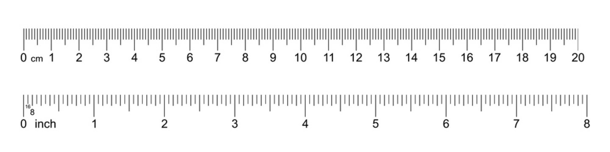
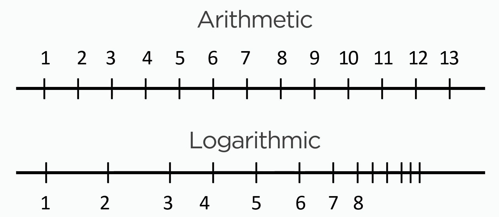

## Homogeneity of variance


<div style="float: left; width: 60%;">

```{r out.width="100%", fig.height=5.25}
mean = 100
mean2 = 120
sd = 10
sd2 = 10
M1 = paste0("Facebook users\nmean=", mean, ", SD=",sd)
M2 = paste0("Twitter users\nmean=", mean2, ", SD=",sd2)

plot_range <- c(50,150)
ggplot(data = NULL, aes(plot_range)) +
  stat_function(fun = dnorm, n = 101, 
                args = list(mean = mean, sd = sd), 
                aes(colour = M1, linetype = M1)) + 
  stat_function(fun = dnorm, n = 101, 
                args = list(mean = mean2, sd = sd2), 
                aes(colour = M2, linetype = M2)) + 
#    geom_area(stat = "function", fun = dnorm, args = list(mean = mean, sd = sd), 
#            fill = "firebrick", alpha = .5, xlim = c(50,75)) +
  labs(y = "", x = "IQ", color = "Legend", linetype = "Legend") +
  theme(legend.justification = "top",
        legend.key.width = unit(1, "cm")) +
  scale_colour_manual(values = c("firebrick", "blue")) +
  scale_linetype_manual(values = c("solid", "dashed"))
```
</div>

<div style="float: right; width: 40%;">
- Mean difference: 120 - 100 = 20 
- In standard deviations (*t*-value) $\frac{\text{mean differece}}{\text{SD}}$ = 2 
</div>

```{r}
1-pnorm(mean2+(sd2*2), mean = mean, sd=sd)
```


# Linearity | linear-regression models

## Linearity assumption

- Distances between adjacent values must be the same, i.e. $\pm 1$ on a linear scale.
- Distances between 1 inch and 2 inch is 1 etc.

{width=70%}


## Linearity assumption

- Non linear: 
  - Logarithmic scale
- Distance between units is $\cdot$ or $\div$ 10: 0.1, 1, 10, 100
- Used to gain granularity on lower end of a scale but also include large numbers
- In psychology log-transformations are often used for distributions with right skew (e.g. reaction times).


{width=70%}


## Linearity assumption

{width=70%}


## Linearity assumption

- Physiological and psychological development could be better represented on a log scale.

{width=70%}

## Linearity assumption

```{r}
n <- 10
x <- seq(1,30,.25)
x_len <- length(x)
reps <- replicate(n, 20000 * log(x,20) + rnorm(length(x), sd = 3500))
data <- round(reps,0) %>% as_tibble() %>%
  pivot_longer(everything(), names_to = "ppt", values_to = "words") %>%
  arrange(ppt) %>%
  mutate(age = rep(x, n),
         words = ifelse(words < 0, 0, words))

ggplot(data, aes(y = words, x = age)) +
  geom_smooth(se = FALSE, formula = y ~ log(x), colour = "red") +
  geom_point(size = 1, alpha = .5) +
  scale_y_continuous(breaks = seq(0, 4e4, 1e4), limits = c(0, 4e4)) +
  labs(x = "Age (in years", y = "Estimated vocabulary size\n(in number of words)")

```


## Linearity assumption

```{r}

ggplot(data, aes(y = words, x = age)) +
  geom_smooth(se = FALSE, formula = y ~ log(x), colour = "red") +
  geom_point(size = 1, alpha = .5) +
  scale_y_continuous(breaks = seq(0, 4e4, 1e4), limits = c(0, 4e4)) +
  labs(x = "Age (in years", y = "Estimated vocabulary size\n(in number of words)") +
  scale_x_log10()

```


## Linearity assumption | no problem for categorical predictors (model from above)


## Linearity assumption | possible problem for continuous predictors (new model)